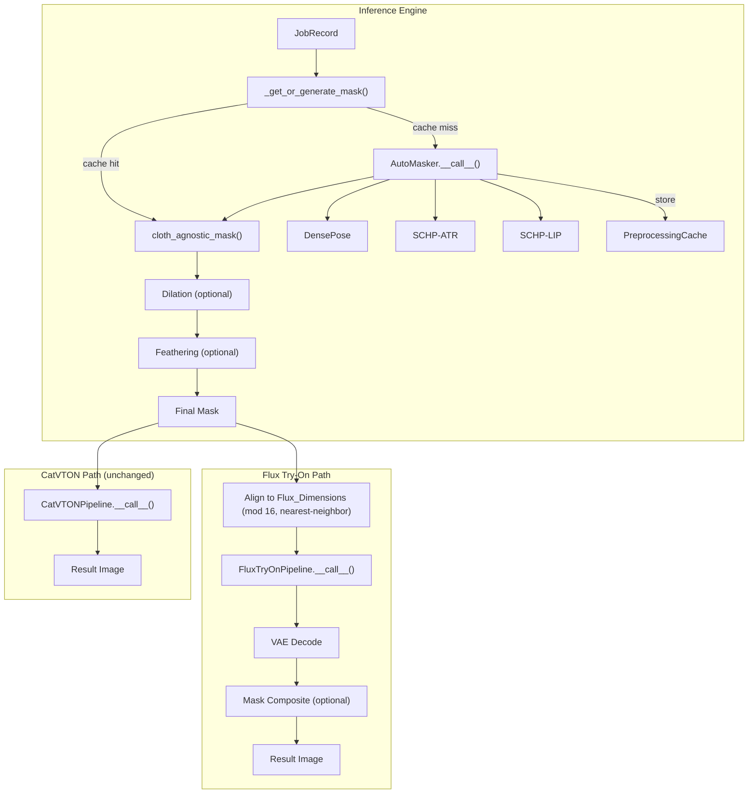

# Design Document: Flux AutoMasker Integration

## Overview

This design integrates the existing garment-agnostic mask generator (`AutoMasker` in `model/cloth_masker.py`) into the Flux try-on path so that inpaint masks are constructed per garment type (`upper`, `lower`, `overall`, `inner`, `outer`) rather than using a crude fixed-rectangle placeholder.

The key change consolidates the `_get_or_generate_mask` helper in `InferenceEngine` to:
1. Validate cloth_type before invoking AutoMasker.
2. Apply optional mask dilation and feathering post-processing.
3. Cache DensePose/SCHP preprocessing outputs for reuse.
4. Resize the mask to Flux-aligned dimensions (multiples of 16) via nearest-neighbor interpolation.
5. Optionally composite unmasked regions back after Flux decoding.

CatVTON behavior is preserved by defaulting all new controls (dilation, feathering, composite) to their no-op values when not explicitly enabled.

## Architecture



### Design Decisions

1. **Shared Mask_Helper for both pipelines**: Both CatVTON and Flux call `_get_or_generate_mask`. This prevents code divergence and ensures consistent fallback behavior. CatVTON defaults keep dilation=0, feathering=0, composite=disabled — making the output byte-identical to pre-feature behavior.

2. **Validation before invocation**: The mask helper validates `cloth_type` against the allowed set before calling AutoMasker. Invalid types short-circuit with a descriptive error, preventing wasted GPU compute.

3. **Mask dimensions match person image**: The mask is always produced at the person image's native resolution. Resizing to Flux_Dimensions happens downstream in the Flux pipeline call, keeping the mask helper resolution-agnostic.

4. **Nearest-neighbor resize for masks**: Binary/near-binary masks must not gain intermediate values from bilinear interpolation. Nearest-neighbor preserves the binary nature.

5. **Dilation before feathering**: Dilation expands the mask outward (ensuring full garment coverage), then feathering softens the transition. Reversing this order would blur the edge before expanding, producing incorrect geometry.

6. **Post-decode composite**: The composite step runs after Flux decoding (not inside the pipeline) so it works regardless of how the pipeline processes the mask internally. This is conceptually a "paste-back" operation.

7. **Cache keyed by image content hash**: Using a perceptual or content hash (SHA-256 of raw pixel bytes or the person image URL) ensures that identical images hit the same cache entry regardless of object identity.

## Components and Interfaces

### 1. MaskHelper (enhanced `_get_or_generate_mask`)

```python
class InferenceEngine:
    def _get_or_generate_mask(
        self,
        job: JobRecord,
        user_image: Image.Image,
        *,
        dilation_px: int = 0,
        feather_px: int = 0,
    ) -> Image.Image:
        """
        Generate or retrieve a garment-agnostic mask for the given job.

        Args:
            job: The job record containing cloth_type.
            user_image: The person PIL image.
            dilation_px: Pixels to dilate the mask outward (0 = no dilation).
            feather_px: Gaussian blur radius for edge feathering (0 = no feathering).

        Returns:
            Single-channel grayscale (mode "L") PIL image with same dimensions
            as user_image. White (255) = regenerate, Black (0) = preserve.

        Raises:
            ValueError: If cloth_type is not in VALID_CLOTH_TYPES.
        """
```

### 2. Dimension Alignment Utility

```python
def align_to_multiple_of_16(width: int, height: int) -> tuple[int, int]:
    """
    Round width and height up to the nearest multiple of 16.

    Args:
        width: Input width in pixels.
        height: Input height in pixels.

    Returns:
        (aligned_width, aligned_height) each divisible by 16.
    """
    aligned_w = ((width + 15) // 16) * 16
    aligned_h = ((height + 15) // 16) * 16
    return aligned_w, aligned_h
```

### 3. Mask Post-Processing

```python
def dilate_mask(mask: Image.Image, dilation_px: int) -> Image.Image:
    """
    Expand white regions of a binary mask by dilation_px using a circular kernel.

    Args:
        mask: Mode "L" PIL image (binary: 0 or 255).
        dilation_px: Radius of the dilation kernel.

    Returns:
        Dilated mask (mode "L").
    """

def feather_mask(mask: Image.Image, feather_px: int) -> Image.Image:
    """
    Apply Gaussian blur to mask edges to create smooth transitions.

    Args:
        mask: Mode "L" PIL image.
        feather_px: Standard deviation (radius) of the Gaussian blur.

    Returns:
        Feathered mask (mode "L") with values transitioning from 255 to 0.
    """
```

### 4. Mask Composite

```python
def composite_with_mask(
    person_image: Image.Image,
    decoded_output: Image.Image,
    mask: Image.Image,
    feather_px: int = 0,
) -> Image.Image:
    """
    Composite the decoded Flux output with the original person image
    using the mask as blend weight.

    Where mask=0: pixel from person_image (preserved).
    Where mask=255: pixel from decoded_output (regenerated).
    Intermediate values: linear blend.

    All inputs are resized to decoded_output dimensions before compositing.

    Args:
        person_image: Original person image.
        decoded_output: Flux pipeline decoded result.
        mask: Single-channel mask used for inference.
        feather_px: Gaussian blur radius for feathered compositing (0 = hard edges).

    Returns:
        Composited RGB image at decoded_output dimensions.
    """
```

### 5. Preprocessing Cache Interface

```python
class PreprocessingCache:
    """
    Cache for DensePose and SCHP outputs keyed by person image content.

    Storage format: lossless PNG bytes for each of the three outputs.
    Cache key: SHA-256 of the person image's raw RGB pixel bytes.
    """

    def get(self, image_key: str) -> Optional[PreprocessResult]:
        """Retrieve cached preprocessing outputs. Returns None on miss."""

    def put(self, image_key: str, result: PreprocessResult) -> None:
        """Store preprocessing outputs."""

    @staticmethod
    def compute_key(image: Image.Image) -> str:
        """Compute a deterministic cache key from image pixel content."""
```

### 6. Smoke Test (updated `scripts/flux_t4_smoketest.py`)

New CLI arguments:
- `--cloth-type` (choices: upper, lower, overall, inner, outer; default: upper)
- `--mask` (existing, now optional override for AutoMasker)

Mask resolution flow:
1. If `--mask` provided → load, convert to "L", resize to (width, height).
2. Else if AutoMasker available → generate mask with cloth_type, resize to (width, height).
3. Else → blank mask (all 255) at (width, height), log warning.

### 7. InferenceConfig Extensions

```python
@dataclass
class InferenceConfig:
    # ... existing fields ...

    # Mask post-processing
    mask_dilation_px: int = 0         # pixels to dilate mask outward
    mask_feather_px: int = 0          # Gaussian blur radius for mask edge

    # Composite control
    mask_composite_enabled: bool = True  # paste original into unmasked regions
    mask_composite_feather_px: int = 0   # feather radius for composite blend (0-50)
```

## Data Models

### PreprocessResult (existing in `worker/models.py`)

```python
@dataclass
class PreprocessResult:
    densepose_png: bytes    # lossless PNG bytes of DensePose output
    schp_atr_png: bytes     # lossless PNG bytes of SCHP ATR output
    schp_lip_png: bytes     # lossless PNG bytes of SCHP LIP output
```

### MaskConfig (new, embedded in InferenceConfig)

| Field | Type | Default | Description |
|-------|------|---------|-------------|
| `mask_dilation_px` | int | 0 | Outward dilation radius in pixels |
| `mask_feather_px` | int | 0 | Gaussian blur radius for mask edges |
| `mask_composite_enabled` | bool | True | Enable post-decode composite |
| `mask_composite_feather_px` | int | 0 | Feather radius for composite blending (0–50) |

### VALID_CLOTH_TYPES

```python
VALID_CLOTH_TYPES = frozenset({"upper", "lower", "overall", "inner", "outer"})
```

### Cache Key Computation

```python
import hashlib

def compute_image_key(image: Image.Image) -> str:
    """SHA-256 of raw RGB pixel bytes — deterministic for identical content."""
    rgb = image.convert("RGB")
    return hashlib.sha256(rgb.tobytes()).hexdigest()
```

## Correctness Properties

*A property is a characteristic or behavior that should hold true across all valid executions of a system — essentially, a formal statement about what the system should do. Properties serve as the bridge between human-readable specifications and machine-verifiable correctness guarantees.*

### Property 1: AutoMasker delegation correctness

*For any* valid cloth_type in {upper, lower, overall, inner, outer} and any person image, the Mask_Helper SHALL invoke AutoMasker exactly once with `mask_type` equal to the provided cloth_type, and SHALL return a single-channel grayscale mask whose width and height equal those of the person image.

**Validates: Requirements 1.1, 1.2, 1.4, 2.1**

### Property 2: Invalid cloth_type rejection

*For any* string not in {upper, lower, overall, inner, outer}, the Mask_Helper SHALL return an error without invoking AutoMasker or the pipeline, and SHALL leave job inputs unmodified.

**Validates: Requirements 1.5**

### Property 3: Blank mask fallback

*For any* person image dimensions (W, H), when AutoMasker is unavailable (disabled or None), the Mask_Helper SHALL return a single-channel grayscale image of size (W, H) with every pixel set to 255.

**Validates: Requirements 1.6, 3.2, 8.3**

### Property 4: Dimension alignment to multiples of 16

*For any* positive integer width and height, the alignment function SHALL return values that are (a) each ≥ the input, (b) each divisible by 16, and (c) each the smallest such value ≥ the input.

**Validates: Requirements 2.3, 2.5**

### Property 5: Nearest-neighbor resize preserves binary values

*For any* binary mask (pixels in {0, 255}) at arbitrary dimensions, resizing to Flux_Dimensions using nearest-neighbor interpolation SHALL produce a mask whose pixels are all in {0, 255} (no intermediate values introduced).

**Validates: Requirements 2.2, 2.4**

### Property 6: Error isolation in batch processing

*For any* batch of N ≥ 2 jobs where exactly one job's AutoMasker call raises an error, the remaining N−1 jobs SHALL each produce a valid InferenceResult with a non-None image.

**Validates: Requirements 3.4**

### Property 7: Dilation monotonicity

*For any* binary mask and any positive dilation amount, the dilated mask SHALL have a white-pixel count greater than or equal to the original mask's white-pixel count.

**Validates: Requirements 5.1**

### Property 8: Feathering produces intermediate values

*For any* binary mask containing both 0 and 255 regions with a boundary of at least 1 pixel, and any feathering radius > 0, the feathered mask SHALL contain at least one pixel with a value strictly between 0 and 255.

**Validates: Requirements 5.2**

### Property 9: Identity when dilation=0 and feathering=0

*For any* mask produced by AutoMasker, when dilation is 0 and feathering is 0, the Mask_Helper output SHALL be byte-identical to the raw AutoMasker output.

**Validates: Requirements 5.3, 8.2, 8.4**

### Property 10: Dilation-before-feathering ordering

*For any* binary mask with both 0 and 255 regions, dilation > 0, and feathering > 0, the Mask_Helper output SHALL equal the result of applying dilation first then feathering, and SHALL differ from applying feathering first then dilation (for non-trivial masks where the operations are non-commutative).

**Validates: Requirements 5.6**

### Property 11: Composite preserves unmasked pixels

*For any* person image, decoded output, and binary mask where some pixels are 0, when composite is enabled, the composited result's pixels at mask=0 positions SHALL be byte-identical to the corresponding pixels in the person image (after resizing to match output dimensions).

**Validates: Requirements 6.1**

### Property 12: Composite blending formula

*For any* person image, decoded output, and feathered mask (values in [0, 255]), when composite is enabled, the composited pixel values SHALL equal `output × (mask/255) + person × (1 − mask/255)` within ±1 tolerance per channel (rounding).

**Validates: Requirements 6.2, 6.3**

### Property 13: Composite disabled is identity

*For any* decoded output image, when composite is disabled, the returned image SHALL be byte-identical to the decoded output.

**Validates: Requirements 6.4**

### Property 14: Cache round-trip fidelity

*For any* valid DensePose/SCHP output images, serializing to PNG bytes and deserializing back SHALL produce images that, when passed to `cloth_agnostic_mask`, yield a mask byte-identical to the one produced from the original (non-serialized) images.

**Validates: Requirements 7.3**

### Property 15: Cache hit skips recomputation

*For any* person image with a complete cache entry (all three outputs present), invoking the Mask_Helper SHALL produce a mask without calling DensePose or SCHP processors.

**Validates: Requirements 7.1, 7.4**

### Property 16: Cache key determinism

*For any* two PIL Image objects with identical RGB pixel content (regardless of object identity, metadata, or creation path), the computed cache key SHALL be identical.

**Validates: Requirements 7.6**

## Error Handling

| Scenario | Behavior |
|----------|----------|
| AutoMasker fails to load at startup | Log warning with exception details, set `self.auto_masker = None`, continue startup |
| Invalid `cloth_type` on job | Return `InferenceResult(error="Invalid cloth_type: '{value}'. Must be one of: upper, lower, overall, inner, outer")`, skip pipeline invocation |
| AutoMasker raises during mask generation | Record error on job's `InferenceResult`, continue processing remaining jobs in batch |
| Mask dimension mismatch (cannot resize) | Abort single job with descriptive error, continue batch |
| Cache entry corrupted/unreadable | Treat as cache miss, recompute via AutoMasker, log warning |
| Partial cache (fewer than 3 outputs) | Treat as miss, recompute all three, store complete entry |
| Composite enabled but mask absent/invalid | Return decoded output unmodified, surface warning in result |
| Negative/non-integer dilation or feathering config | Reject at config validation, retain previous valid value, return error indication |
| Manual mask file not found (smoke test) | Exit with code 1 and descriptive error message |
| Invalid cloth_type CLI argument (smoke test) | Exit with code 1, list valid values |

## Testing Strategy

### Property-Based Tests (Hypothesis)

The project already uses `pytest` + `hypothesis` (visible in `.hypothesis/` directory and `worker/tests/test_inference_engine.py`). Property-based tests will use the same framework.

**Library**: [Hypothesis](https://hypothesis.readthedocs.io/) (Python)

**Configuration**: Minimum 100 examples per property test (`@settings(max_examples=100)`).

**Tag format**: Each test will include a comment:
```python
# Feature: flux-automasker-integration, Property {N}: {title}
```

**Properties to implement as PBTs**:
- Property 1–5: Mask helper logic (delegation, validation, fallback, alignment, resize)
- Property 6: Error isolation
- Property 7–10: Dilation/feathering (monotonicity, intermediate values, identity, ordering)
- Property 11–13: Composite correctness
- Property 14–16: Cache fidelity

### Unit Tests (example-based)

- AutoMasker startup failure graceful degradation (Req 3.1)
- Warning logged on fallback (Req 3.3)
- Shared Mask_Helper used by both pipelines (Req 3.5, 8.1)
- Smoke test CLI argument parsing (Req 4.3)
- Smoke test manual mask override (Req 4.2)
- Smoke test blank mask fallback (Req 4.5)
- Default config values (Req 5.4, 6.6)
- CatVTON explicit enable of controls (Req 8.5)

### Edge Case Tests

- Mask dimension mismatch abort (Req 2.6)
- Composite with absent mask (Req 6.5)
- Corrupted cache entry (Req 7.5)
- Invalid cloth_type exit code (Req 4.4)
- Unreadable mask file exit (Req 4.6)

### Integration Tests

- End-to-end Flux path with mock AutoMasker outputs (Req 1.3)
- Smoke test full run with synthetic images (Req 4.1, 4.7)
