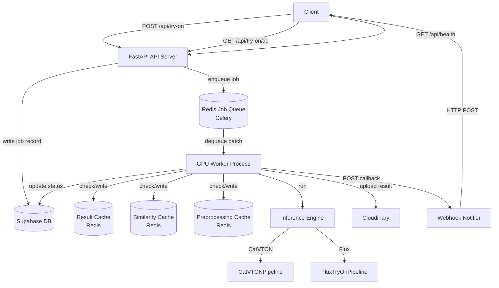
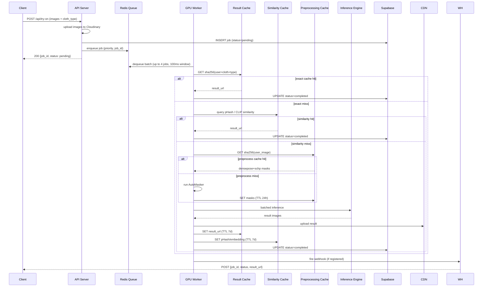
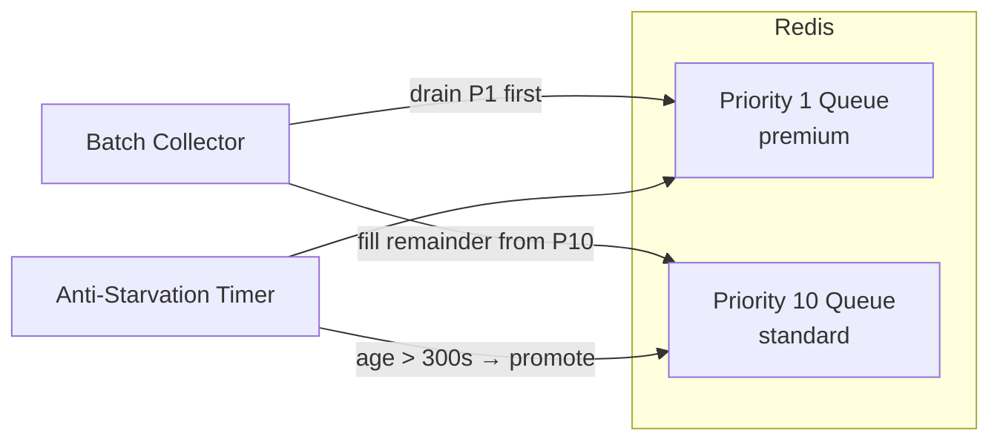

# Design Document: Queue Batching Worker Optimization

## Overview

This design replaces the current fire-and-forget `BackgroundTasks` pattern in `FrontEnd/fastAPI/main.py`
with a production-grade, queue-backed inference pipeline. The core idea is a clean separation of concerns:

- **API Server** (FastAPI) — accepts HTTP requests, enqueues jobs, returns job IDs immediately
- **Job Queue** (Redis + Celery) — persists jobs, enforces priority ordering, survives restarts
- **GPU Worker** (Celery worker process) — dequeues jobs, checks caches, runs batched inference, fires webhooks
- **Cache Layer** (Redis) — three-tier: exact result cache → similarity cache → preprocessing cache
- **Inference Engine** — thin wrapper over `CatVTONPipeline` / `FluxTryOnPipeline` with flash attention and VAE tiling

The existing Supabase job-status tracking and Cloudinary image storage are preserved and extended.

---

## Architecture

### System Components



### Data Flow — Happy Path



### Priority Queue and Anti-Starvation



---

## Components and Interfaces

### 1. API Server (`worker/api_server.py`)

Thin FastAPI layer. Validates input, uploads to Cloudinary, inserts a Supabase record, enqueues to Celery.

```python
@app.post("/api/try-on")
async def try_on(
    user_image: UploadFile,
    cloth_image: UploadFile,
    category_id: str = Form(...),
    user_tier: str = Form(default="standard"),   # "premium" | "standard"
    webhook_url: Optional[str] = Form(default=None),
) -> TryOnResponse: ...

@app.get("/api/try-on/{try_on_id}")
async def get_status(try_on_id: str) -> JobStatusResponse: ...

@app.get("/api/health")
async def health() -> HealthResponse: ...
```

### 2. Job Queue (`worker/queue.py`)

Celery app configured against Redis. Two queues: `tryon.priority` (priority 1) and `tryon.standard`
(priority 10). The Celery worker is started with `--queues tryon.priority,tryon.standard`.

```python
def enqueue_job(job: JobRecord, priority: int) -> str:
    """Enqueue a try-on job. Returns Celery task ID."""

def get_queue_depth() -> dict[str, int]:
    """Return {queue_name: depth} for health endpoint."""
```

### 3. Batch Collector (`worker/batch_collector.py`)

Runs inside the GPU worker. Accumulates jobs from the queue up to `BATCH_SIZE` (default 4) or
`BATCH_TIMEOUT_MS` (default 100ms), whichever fires first.

```python
class BatchCollector:
    def __init__(self, max_size: int, timeout_ms: int): ...
    def collect(self) -> list[JobRecord]:
        """Block until batch is ready. Returns 1..max_size jobs."""
```

### 4. Cache Layer (`worker/cache.py`)

All three caches share a single Redis connection pool.

```python
class PreprocessingCache:
    def get(self, image_hash: str) -> Optional[PreprocessResult]: ...
    def set(self, image_hash: str, result: PreprocessResult, ttl: int) -> None: ...

class ResultCache:
    def get(self, result_key: str) -> Optional[str]: ...          # returns result_url
    def set(self, result_key: str, url: str, ttl: int) -> None: ...

class SimilarityCache:
    def query(self, user_hash: int, cloth_hash: int, threshold: int) -> Optional[str]: ...
    def store(self, user_hash: int, cloth_hash: int, result_key: str, ttl: int) -> None: ...
```

### 5. Inference Engine (`worker/inference_engine.py`)

Wraps both pipelines behind a unified interface. Handles flash attention setup, VAE tiling/slicing,
and batched forward passes.

```python
class InferenceEngine:
    def __init__(self, config: InferenceConfig): ...

    def run_batch(self, jobs: list[JobRecord]) -> list[InferenceResult]:
        """Run a single batched forward pass. Returns results in input order."""
```

### 6. GPU Worker (`worker/gpu_worker.py`)

Celery task that orchestrates the full pipeline per batch.

```python
@celery_app.task(name="tryon.process_batch", bind=True)
def process_batch(self, job_ids: list[str]) -> None: ...
```

### 7. Webhook Notifier (`worker/webhook_notifier.py`)

```python
def notify(job: JobRecord, max_retries: int = 3, base_delay: float = 1.0) -> None:
    """POST job result to webhook_url with exponential backoff."""
```

---

## Data Models

### `JobRecord`

```python
@dataclass
class JobRecord:
    id: str                          # UUID
    user_image_url: str
    cloth_image_url: str
    cloth_type: str                  # "upper" | "lower" | "overall" | "inner" | "outer"
    status: str                      # "pending" | "processing" | "completed" | "failed"
    priority: int                    # 1 (premium) | 10 (standard)
    user_tier: str                   # "premium" | "standard"
    webhook_url: Optional[str]
    result_image_url: Optional[str]
    error: Optional[str]
    created_at: datetime
    completed_at: Optional[datetime]
    enqueued_at: datetime            # used for anti-starvation age calculation
```

### `PreprocessResult`

```python
@dataclass
class PreprocessResult:
    densepose_png: bytes    # lossless PNG bytes of DensePose output
    schp_atr_png: bytes     # lossless PNG bytes of SCHP ATR output
    schp_lip_png: bytes     # lossless PNG bytes of SCHP LIP output
```

### `InferenceResult`

```python
@dataclass
class InferenceResult:
    job_id: str
    image: Optional[PIL.Image.Image]
    error: Optional[str]
```

### `InferenceConfig`

```python
@dataclass
class InferenceConfig:
    pipeline_type: str          # "catvton" | "flux"
    device: str                 # "cuda:0", "cuda:1", ...
    batch_size: int             # default 4
    flash_attention: bool       # default True
    vae_tiling: bool            # default True
    vae_slicing: bool           # default True
    vae_tiling_resolution: int  # default 1024 — enable tiling above this px
```

### `SimilarityEntry` (Redis hash stored per result_key)

```python
# Redis key: similarity:{result_key}
# Fields:
#   user_phash   -> int (64-bit pHash) or str (base64 CLIP embedding)
#   cloth_phash  -> int (64-bit pHash) or str (base64 CLIP embedding)
#   result_key   -> str (points back to ResultCache key)
```

### Cache Key Schemes

| Cache | Key | Value |
|---|---|---|
| Result Cache | `result:{sha256(user_bytes + cloth_bytes + cloth_type)}` | Cloudinary URL string |
| Preprocessing Cache | `preprocess:{sha256(user_bytes)}` | msgpack of `PreprocessResult` |
| Similarity Cache | `simindex` (Redis sorted set or hash scan) | `SimilarityEntry` per result_key |

### Environment Variables

| Variable | Default | Description |
|---|---|---|
| `REDIS_URL` | `redis://localhost:6379/0` | Redis connection string |
| `BATCH_SIZE` | `4` | Max jobs per inference batch |
| `BATCH_TIMEOUT_MS` | `100` | Batch collection window |
| `PREPROCESS_CACHE_TTL` | `86400` | Preprocessing cache TTL (seconds) |
| `RESULT_CACHE_TTL` | `604800` | Result cache TTL (seconds) |
| `PRIORITY_WAIT_THRESHOLD` | `300` | Anti-starvation promotion threshold (seconds) |
| `FLASH_ATTENTION` | `true` | Enable flash attention |
| `VAE_TILING` | `true` | Enable VAE tiling |
| `VAE_SLICING` | `true` | Enable VAE slicing |
| `VAE_TILING_RESOLUTION` | `1024` | Resolution threshold for auto-tiling |
| `SIMILARITY_METHOD` | `phash` | `phash` or `clip` |
| `SIMILARITY_THRESHOLD` | `8` | Max Hamming distance (phash) or min cosine (clip, e.g. `0.97`) |
| `CLIP_MODEL_PATH` | `` | Path to CLIP model (required if `SIMILARITY_METHOD=clip`) |
| `PIPELINE_TYPE` | `catvton` | `catvton` or `flux` |
| `GPU_DEVICE` | `cuda:0` | GPU device for this worker |
| `WORKER_COUNT` | `1` | Number of Celery worker processes |

---

## Correctness Properties

*A property is a characteristic or behavior that should hold true across all valid executions of a system — essentially, a formal statement about what the system should do. Properties serve as the bridge between human-readable specifications and machine-verifiable correctness guarantees.*


### Property 1: Batch output order matches input order

*For any* batch of N jobs (1 ≤ N ≤ BATCH_SIZE), the Inference_Engine SHALL produce exactly N results where `results[i].job_id == jobs[i].id` for every index i.

**Validates: Requirements 3.4**

```python
@given(jobs=st.lists(job_strategy(), min_size=1, max_size=4))
def test_batch_output_order(jobs):
    engine = InferenceEngine(config=mock_config())
    results = engine.run_batch(jobs)
    assert len(results) == len(jobs)
    for i, (job, result) in enumerate(zip(jobs, results)):
        assert result.job_id == job.id
```

---

### Property 2: Worker isolation — one failure does not affect other batch members

*For any* batch where exactly one job is configured to raise an inference error, only that job's `InferenceResult` SHALL have a non-None `error` field; all other results SHALL have `error == None` and a non-None `image`.

**Validates: Requirements 2.5, 3.5**

```python
@given(
    jobs=st.lists(job_strategy(), min_size=2, max_size=4),
    fail_index=st.integers(min_value=0, max_value=3),
)
def test_worker_isolation(jobs, fail_index):
    assume(fail_index < len(jobs))
    # Patch inference to raise only for jobs[fail_index]
    results = run_batch_with_one_failure(jobs, fail_index)
    for i, result in enumerate(results):
        if i == fail_index:
            assert result.error is not None
        else:
            assert result.error is None
            assert result.image is not None
```

---

### Property 3: Result cache key is deterministic

*For any* triple (user_image_bytes, cloth_image_bytes, cloth_type), computing the SHA-256 result cache key twice SHALL produce the identical key both times, and two triples that differ in any component SHALL produce different keys.

**Validates: Requirements 5.1**

```python
@given(
    user_bytes=st.binary(min_size=1, max_size=4096),
    cloth_bytes=st.binary(min_size=1, max_size=4096),
    cloth_type=st.sampled_from(["upper", "lower", "overall", "inner", "outer"]),
)
def test_result_cache_key_determinism(user_bytes, cloth_bytes, cloth_type):
    key1 = compute_result_cache_key(user_bytes, cloth_bytes, cloth_type)
    key2 = compute_result_cache_key(user_bytes, cloth_bytes, cloth_type)
    assert key1 == key2

@given(
    a=job_input_strategy(),
    b=job_input_strategy(),
)
def test_result_cache_key_uniqueness(a, b):
    assume(a != b)
    assert compute_result_cache_key(*a) != compute_result_cache_key(*b)
```

---

### Property 4: Preprocessing cache round-trip preserves mask data exactly

*For any* `PreprocessResult` containing DensePose, SCHP-ATR, and SCHP-LIP mask arrays, serializing to lossless PNG bytes and deserializing SHALL produce pixel-identical arrays.

**Validates: Requirements 4.5**

```python
@given(result=preprocess_result_strategy())
def test_preprocessing_cache_round_trip(result):
    cache = PreprocessingCache(redis=mock_redis())
    key = "test_" + secrets.token_hex(8)
    cache.set(key, result, ttl=3600)
    retrieved = cache.get(key)
    assert retrieved is not None
    assert np.array_equal(np.array(retrieved.densepose_png), np.array(result.densepose_png))
    assert np.array_equal(np.array(retrieved.schp_atr_png), np.array(result.schp_atr_png))
    assert np.array_equal(np.array(retrieved.schp_lip_png), np.array(result.schp_lip_png))
```

---

### Property 5: Exact cache hit skips inference

*For any* job whose result cache key is already present in the Result_Cache, the Inference_Engine's `run_batch` SHALL NOT be called, and the job SHALL be marked "completed" with the cached URL.

**Validates: Requirements 5.2**

```python
@given(job=job_strategy(), cached_url=st.text(min_size=10))
def test_exact_cache_hit_skips_inference(job, cached_url):
    result_cache = ResultCache(redis=mock_redis())
    key = compute_result_cache_key(
        job.user_image_bytes, job.cloth_image_bytes, job.cloth_type
    )
    result_cache.set(key, cached_url, ttl=604800)

    inference_mock = MagicMock()
    worker = GPUWorker(result_cache=result_cache, inference_engine=inference_mock)
    worker.process([job])

    inference_mock.run_batch.assert_not_called()
    assert job.status == "completed"
    assert job.result_image_url == cached_url
```

---

### Property 6: Priority assignment maps user tier to correct priority value

*For any* job submission, premium tier SHALL always receive priority 1 and standard tier SHALL always receive priority 10; no other tier values SHALL be assigned.

**Validates: Requirements 8.1**

```python
@given(tier=st.sampled_from(["premium", "standard"]))
def test_priority_assignment(tier):
    job = enqueue_job(user_tier=tier, ...)
    expected = 1 if tier == "premium" else 10
    assert job.priority == expected
```

---

### Property 7: Batch collector drains premium jobs before standard jobs

*For any* queue state containing a mix of premium (priority 1) and standard (priority 10) jobs, the Batch_Collector SHALL select all available premium jobs before selecting any standard jobs.

**Validates: Requirements 8.2**

```python
@given(
    premium_count=st.integers(min_value=0, max_value=4),
    standard_count=st.integers(min_value=0, max_value=4),
)
def test_batch_priority_ordering(premium_count, standard_count):
    assume(premium_count + standard_count >= 1)
    queue = build_mixed_queue(premium_count, standard_count)
    collector = BatchCollector(max_size=4, timeout_ms=0)
    batch = collector.collect(queue)
    # All premium jobs in the batch must come before any standard job
    priorities = [j.priority for j in batch]
    first_standard = next((i for i, p in enumerate(priorities) if p == 10), len(priorities))
    assert all(p == 1 for p in priorities[:first_standard])
```

---

### Property 8: Anti-starvation promotes standard jobs past the wait threshold

*For any* standard job whose `enqueued_at` timestamp is older than `PRIORITY_WAIT_THRESHOLD` seconds, the anti-starvation check SHALL promote that job to priority 1 before the next batch collection cycle.

**Validates: Requirements 8.3**

```python
@given(
    wait_seconds=st.integers(min_value=301, max_value=3600),
    threshold=st.just(300),
)
def test_anti_starvation_promotion(wait_seconds, threshold):
    job = make_standard_job(
        enqueued_at=datetime.utcnow() - timedelta(seconds=wait_seconds)
    )
    promote_stale_jobs(queue=[job], threshold_seconds=threshold)
    assert job.priority == 1
```

---

### Property 9: Webhook delivery is attempted for every terminal job state

*For any* job that transitions to "completed" or "failed" and has a non-None `webhook_url`, the Webhook_Notifier SHALL make at least one HTTP POST attempt to that URL containing the job ID and final status.

**Validates: Requirements 9.2, 9.3**

```python
@given(
    job=job_strategy(),
    final_status=st.sampled_from(["completed", "failed"]),
)
def test_webhook_delivery_on_terminal_state(job, final_status):
    assume(job.webhook_url is not None)
    http_mock = MockHTTPClient(always_succeed=True)
    notifier = WebhookNotifier(http_client=http_mock)
    job.status = final_status
    notifier.notify(job)
    assert http_mock.post_call_count >= 1
    payload = http_mock.last_payload
    assert payload["job_id"] == job.id
    assert payload["status"] == final_status
```

---

### Property 10: Webhook retries exactly up to 3 times on failure

*For any* job with a webhook URL where every HTTP POST attempt returns a non-2xx response, the Webhook_Notifier SHALL make exactly 1 initial attempt plus up to 3 retry attempts (4 total), then stop.

**Validates: Requirements 9.4**

```python
@given(job=job_strategy_with_webhook())
def test_webhook_retry_count(job):
    http_mock = MockHTTPClient(always_fail=True)
    notifier = WebhookNotifier(http_client=http_mock, max_retries=3)
    notifier.notify(job)
    assert http_mock.post_call_count == 4  # 1 initial + 3 retries
```

---

### Property 11: Similarity cache requires BOTH images to match

*For any* query where the user image hash is within the threshold but the cloth image hash is not (or vice versa), the Similarity_Cache SHALL return a miss, not a hit.

**Validates: Requirements 11.2**

```python
@given(
    stored=similarity_entry_strategy(),
    threshold=st.integers(min_value=1, max_value=8),
)
def test_similarity_requires_both_images(stored, threshold):
    cache = SimilarityCache(redis=mock_redis(), threshold=threshold)
    cache.store(stored.user_hash, stored.cloth_hash, stored.result_key, ttl=604800)

    # User matches, cloth does not
    far_cloth_hash = stored.cloth_hash ^ (0xFFFFFFFFFFFFFFFF)  # flip all bits → max distance
    result = cache.query(stored.user_hash, far_cloth_hash, threshold)
    assert result is None

    # Cloth matches, user does not
    far_user_hash = stored.user_hash ^ (0xFFFFFFFFFFFFFFFF)
    result = cache.query(far_user_hash, stored.cloth_hash, threshold)
    assert result is None

    # Both match (within threshold)
    result = cache.query(stored.user_hash, stored.cloth_hash, threshold)
    assert result == stored.result_key
```

---

### Property 12: Exact cache is checked before similarity cache

*For any* job whose exact result cache key is present, the Similarity_Cache query method SHALL NOT be called.

**Validates: Requirements 11.5**

```python
@given(job=job_strategy())
def test_exact_before_similarity(job):
    result_cache = ResultCache(redis=mock_redis())
    key = compute_result_cache_key(
        job.user_image_bytes, job.cloth_image_bytes, job.cloth_type
    )
    result_cache.set(key, "https://cdn.example.com/result.jpg", ttl=604800)

    similarity_mock = MagicMock(spec=SimilarityCache)
    worker = GPUWorker(result_cache=result_cache, similarity_cache=similarity_mock)
    worker.process([job])

    similarity_mock.query.assert_not_called()
```

---

### Property 13: Perceptual hash distance is symmetric and bounded

*For any* two images A and B, `hamming_distance(phash(A), phash(B))` SHALL equal `hamming_distance(phash(B), phash(A))` and SHALL be in the range [0, 64].

**Validates: Requirements 11.7**

```python
@given(
    img_a=image_strategy(),
    img_b=image_strategy(),
)
def test_phash_distance_symmetric_and_bounded(img_a, img_b):
    ha = compute_phash(img_a)
    hb = compute_phash(img_b)
    d_ab = hamming_distance(ha, hb)
    d_ba = hamming_distance(hb, ha)
    assert d_ab == d_ba
    assert 0 <= d_ab <= 64
```

---

## Error Handling

| Scenario | Behavior |
|---|---|
| Redis unavailable at enqueue time | API returns HTTP 503 with `{"error": "queue_unavailable"}` |
| Redis unavailable during cache lookup | Worker skips cache, logs warning, proceeds with inference |
| AutoMasker raises exception | Job marked "failed", error stored in Supabase, batch continues |
| Inference OOM on GPU | Job marked "failed", worker logs CUDA OOM, batch continues |
| VAE tiling causes runtime error | Tiling disabled, inference retried without tiling, warning logged |
| Webhook POST fails after 3 retries | Failure logged with job ID; job status is already written to Supabase so polling still works |
| Missing required env var at startup | Process logs the variable name and exits with code 1 |
| Supabase write fails | Worker retries once; if still failing, logs error and continues (result is in cache) |

---

## Testing Strategy

### Unit Tests

Focus on specific examples, edge cases, and error conditions:

- Cache key computation with known inputs and expected SHA-256 outputs
- Priority assignment for each `user_tier` value
- Anti-starvation threshold boundary (exactly at 300s, one second over, one second under)
- Webhook payload shape validation
- `BatchCollector` returns 1 job immediately when timeout fires with only 1 job in queue
- `InferenceEngine` falls back gracefully when xformers / flash-attn is not installed

### Property-Based Tests

Use [Hypothesis](https://hypothesis.readthedocs.io/) with a minimum of 100 iterations per property.

Each test is tagged with a comment referencing the design property it validates:

```python
# Feature: queue-batching-worker-optimization, Property 1: batch output order matches input order
```

Properties to implement (one test per property):

| # | Property | Key invariant |
|---|---|---|
| 1 | Batch output order | `results[i].job_id == jobs[i].id` for all i |
| 2 | Worker isolation | One failure → only that result has `error != None` |
| 3 | Cache key determinism | Same inputs → same key; different inputs → different key |
| 4 | Preprocessing cache round-trip | Serialize → deserialize → pixel-identical masks |
| 5 | Exact cache hit skips inference | `run_batch` not called when key in cache |
| 6 | Priority assignment | `premium → 1`, `standard → 10` always |
| 7 | Batch priority ordering | All P1 jobs before any P10 job in collected batch |
| 8 | Anti-starvation promotion | Jobs older than threshold promoted to P1 |
| 9 | Webhook delivery | At least one POST per terminal job with webhook URL |
| 10 | Webhook retry count | Exactly 4 attempts (1 + 3 retries) on persistent failure |
| 11 | Similarity requires both images | Single-image match → miss; both-image match → hit |
| 12 | Exact before similarity | Similarity cache not queried on exact hit |
| 13 | pHash symmetry and bounds | `d(a,b) == d(b,a)`, `0 ≤ d ≤ 64` |

### Integration Tests

Run against a real Redis instance (Docker Compose in CI):

- End-to-end job lifecycle: enqueue → worker picks up → result written to Supabase
- Priority queue ordering under concurrent load (mix of premium and standard jobs)
- Cache TTL expiry (set short TTL, wait, verify miss)
- Multi-worker concurrency: two workers, verify no job is processed twice
