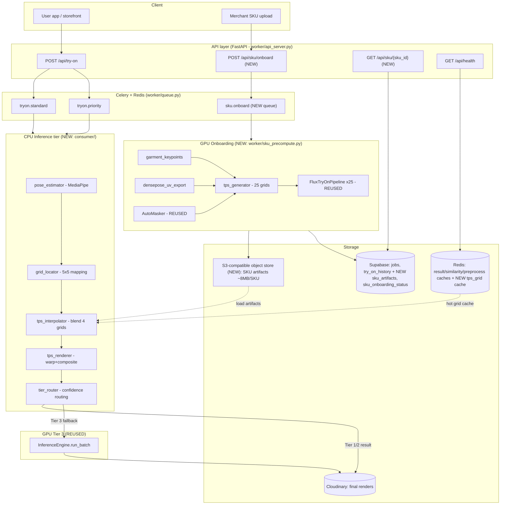
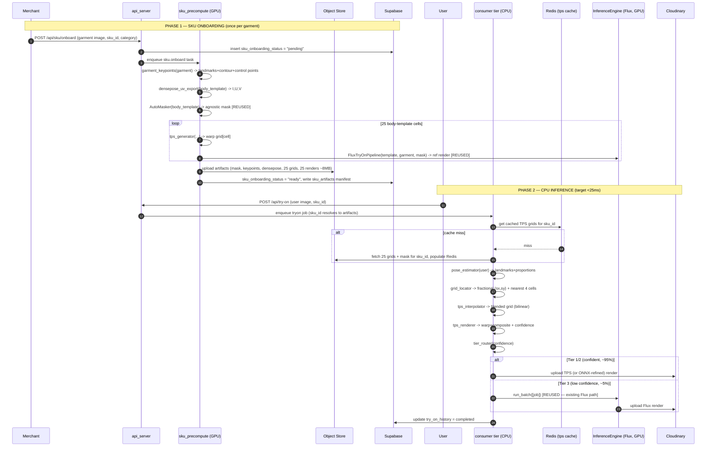
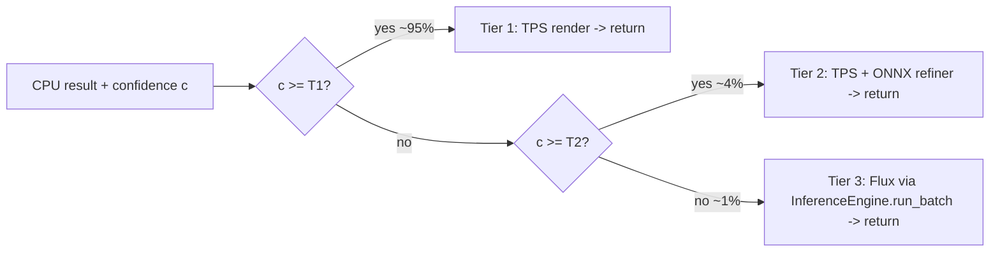
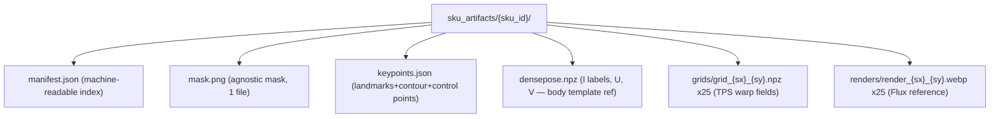
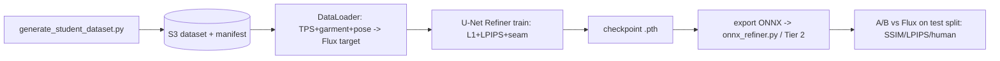

# Design Document: TPS-First Try-On Architecture

## Overview

Today every try-on request runs the full FLUX.1-Fill denoising loop. `FluxTryOnPipeline.__call__` (`model/flux/pipeline_flux_tryon.py:349`) executes 30 timesteps (`FLUX_NUM_INFERENCE_STEPS`, guidance 30.0) per job through `InferenceEngine._run_flux_batch` (`worker/inference_engine.py:298`) — and that loop cannot be shortened (the transformer is timestep-conditioned via AdaLayerNorm, guidance-distilled, and `remove_text_layers()` is destructive). A Flux job costs seconds of GPU time and dominates both latency and cost.

This design introduces a **TPS-first (Thin-Plate-Spline) architecture** that moves the expensive work *off the request path* and into a one-time, per-garment **SKU onboarding** step. The insight: for a given garment, the way it warps onto a body depends mostly on body shape, not on the specific person. So we precompute a small grid of warps once per SKU, then at request time we cheaply **interpolate and warp** instead of denoising. Flux becomes a fallback (Tier 3) for the ~5% of requests the cheap path cannot handle confidently.

The system has two phases:

- **Phase 1 — SKU Onboarding (GPU, once per garment).** Extract garment landmarks/contour/TPS control points, export DensePose UV, generate the garment-agnostic mask (reusing `AutoMasker`), build 25 TPS warp grids against a 5×5 body-template grid, and run Flux once per template to produce reference renders. Artifacts (~8 MB/SKU) are stored in S3-compatible object storage and indexed in Supabase + Redis.
- **Phase 2 — CPU Inference (target < 25 ms, ~95% Flux-avoidance).** Estimate the user's pose with MediaPipe, locate them in the 5×5 body grid, bilinearly blend the nearest 4 cached TPS grids, warp+composite the garment, and emit a confidence score. A tier router sends low-confidence cases to Tier 2 (lightweight ONNX refinement) or Tier 3 (existing Flux via `InferenceEngine.run_batch` — reused, never duplicated).

A separate **Student-Model roadmap** (design only) and a **dataset-generation tool** are specified to eventually replace Tier 3 Flux with a fast learned refiner.

> **Notation:** This is an existing Python project. All low-level signatures use Python type hints consistent with `worker/models.py` and the rest of the codebase. Algorithm-heavy sections additionally give step-by-step pseudocode in `pascal` blocks where math clarity helps.

---

## Goals & Non-Goals

**Goals**
- Serve ~95% of try-on requests on CPU in < 25 ms without invoking Flux.
- Reuse existing components: `DensePose.call_iuv()`, `AutoMasker`, `FluxTryOnPipeline`, `InferenceEngine.run_batch`, the Celery/Redis/Supabase/Cloudinary orchestration.
- Keep Tier 3 byte-for-byte identical to the current Flux path (no behavioral regression for the fallback).
- Bound per-SKU storage to ~8 MB.

**Non-Goals**
- Fully implementing or training the Student Refiner (roadmap + tooling only).
- Replacing the existing CatVTON path.
- Real-time garment onboarding (onboarding is async/batch, minutes per SKU is acceptable).

---

# Part A — High-Level Design

## Architecture



## A.2 End-to-End Data Flow



## Components and Interfaces

| # | Component | New/Reused | Phase | Responsibility |
|---|-----------|-----------|-------|----------------|
| 1 | `model/garment_keypoints.py` | **New** | 1 | Garment image → DeepFashion2-style landmarks, contour, TPS source control points |
| 2 | `model/densepose_uv_export.py` | **New** (wraps existing) | 1 | Production API over `DensePose.call_iuv()` returning I labels, U, V for onboarding |
| 3 | `model/tps_generator.py` | **New** | 1 | (garment keypoints, DensePose UV, body template) → TPS warp grid via OpenCV `createThinPlateSplineShapeTransformer` |
| 4 | `model/body_templates.py` | **New** | 1 | 5×5 body-template grid definition + metadata + template image loading |
| 5 | `worker/sku_precompute.py` | **New** | 1 | Celery task orchestrating onboarding; reuses `AutoMasker` + `FluxTryOnPipeline` |
| 6 | `consumer/pose_estimator.py` | **New** | 2 | MediaPipe Pose → body landmarks + proportions |
| 7 | `consumer/grid_locator.py` | **New** | 2 | Body measurements → fractional 5×5 coords + nearest-4 cells |
| 8 | `consumer/tps_interpolator.py` | **New** | 2 | Bilinear blend of nearest-4 cached TPS grids |
| 9 | `consumer/tps_renderer.py` | **New** | 2 | Warp garment with blended grid, composite onto user, return confidence |
| 10 | `consumer/tier_router.py` | **New** | 2 | Route by confidence: Tier 1 (TPS) / Tier 2 (ONNX) / Tier 3 (Flux) |
| 11 | `worker/inference_engine.py` | **Modified** | 2 | Expose `run_batch` reuse for Tier 3 (no Flux logic duplicated) |
| 12 | `worker/sku_artifacts.py` | **New** | 1&2 | S3 client + artifact (de)serialization, manifest read/write |
| 13 | `DensePose.call_iuv()` | **Reused** | 1 | UV extractor (`model/DensePose/__init__.py:220`) — currently only used by `train.py:233` |
| 14 | `AutoMasker` | **Reused** | 1 | Garment-agnostic mask (`model/cloth_masker.py`) |
| 15 | `FluxTryOnPipeline` / `InferenceEngine` | **Reused** | 1&2 | Reference renders + Tier 3 fallback |

## A.4 Tiered Routing Model (High Level)



- **Tier 1 (TPS only):** confidence ≥ `TPS_TIER1_THRESHOLD` (default 0.75). Pure CPU warp+composite.
- **Tier 2 (TPS + ONNX refinement):** `TPS_TIER2_THRESHOLD` ≤ c < Tier1. A small ONNX seam/shading refiner runs on CPU (onnxruntime).
- **Tier 3 (Flux fallback):** c < Tier2, or no SKU artifacts available. Calls the *existing* `InferenceEngine.run_batch` unchanged.

## Data Models

### A.5.1 Body Template Grid (5×5 = 25 cells)

Two axes, each with 5 ordinal buckets, indexed `[size_idx][height_idx]`:

| Axis | Index 0 | 1 | 2 | 3 | 4 |
|------|---------|---|---|---|---|
| **size** (x) | XS | S | M | L | XL |
| **height** (y) | petite | short | avg | tall | xtall |

Each cell holds a representative body template image + measured proportions. A user maps to a **fractional** coordinate `(sx, sy) ∈ [0,4] × [0,4]` (e.g. `(M, avg) = (2.0, 2.0)`; the prompt's `(0.6, 0.4)` is the normalized form `(sx/4, sy/4)`). Both representations are recorded; the locator returns the nearest 4 integer cells for bilinear interpolation.

### A.5.2 SKU Artifact Bundle (~8 MB target)



Storage budget (per SKU):

| Artifact | Count | Approx size | Notes |
|----------|-------|-------------|-------|
| `manifest.json` | 1 | ~4 KB | index + checksums |
| `mask.png` | 1 | ~30 KB | single-channel PNG |
| `keypoints.json` | 1 | ~10 KB | landmarks + contour polygon + control points |
| `densepose.npz` | 1 | ~250 KB | downsampled I/U/V for the template (float16) |
| `grids/*.npz` | 25 | ~120 KB each (float16, downsampled) ≈ 3 MB | warp displacement fields |
| `renders/*.webp` | 25 | ~160 KB each ≈ 4 MB | WebP q80 reference renders |
| **Total** | — | **≈ 7.3 MB** | within ~8 MB budget |

### A.5.3 Persistence Map

| Data | Store | Key/Table | Lifetime |
|------|-------|-----------|----------|
| SKU artifact bundle | S3-compatible | `sku-artifacts/{sku_id}/...` | permanent (per active SKU) |
| SKU manifest + status | Supabase | `sku_artifacts`, `sku_onboarding_status` | permanent |
| Hot TPS grids | Redis | `tps:grid:{sku_id}:{sx}_{sy}` | TTL `TPS_GRID_CACHE_TTL` (default 7d) |
| SKU mask | Redis | `tps:mask:{sku_id}` | TTL 7d |
| Try-on jobs | Supabase | `jobs`, `try_on_history` | existing |
| Final render | Cloudinary | `tryon_results/...` | existing |
| Result/similarity/preprocess | Redis | existing prefixes (`result:`, `sim:`, `preprocess:`) | existing |

The detailed JSON/SQL schemas are in **Part C — Data Schemas**.

---

# Part B — Low-Level Design

All signatures are Python. Dataclasses live in `worker/models.py` (extended — see Part D). NumPy arrays use explicit shapes/dtypes in comments.

## B.1 Phase 1 — `model/garment_keypoints.py` (NEW)

Garment keypoint extraction does not exist anywhere today (grep confirmed: no TPS, no landmark code, `DeepFashion2/` is cloned but never imported). This module is built from scratch but is structured so a DeepFashion2-trained detector can be dropped in later behind the same interface.

```python
# model/garment_keypoints.py
from dataclasses import dataclass
import numpy as np
from PIL import Image

# DeepFashion2 defines 294 landmark slots across 13 categories. For TPS we only
# need a stable, ordered subset per garment class (collar, shoulders, sleeve
# ends, hem corners, side seams). These indices are the TPS "source" points.
GARMENT_CLASS_LANDMARKS: dict[str, list[str]] = {
    "upper": ["collar_l", "collar_r", "shoulder_l", "shoulder_r",
              "sleeve_l_end", "sleeve_r_end", "armpit_l", "armpit_r",
              "hem_l", "hem_r", "center_top", "center_hem"],
    "lower": ["waist_l", "waist_r", "hip_l", "hip_r",
              "knee_l", "knee_r", "hem_l", "hem_r", "crotch", "center_waist"],
    # "overall"/"inner"/"outer" map to one of the above sets at runtime.
}

@dataclass
class GarmentKeypoints:
    sku_id: str
    garment_class: str                 # "upper" | "lower"
    landmarks: dict[str, tuple[float, float]]   # name -> (x, y) in IMAGE px
    landmark_confidence: dict[str, float]       # name -> [0,1]
    contour: np.ndarray                # (N, 2) float32 — ordered outer polygon
    control_points: np.ndarray         # (K, 2) float32 — TPS source points (subset of landmarks + sampled contour)
    image_size: tuple[int, int]        # (W, H)

class GarmentKeypointExtractor:
    def __init__(self, method: str = "heuristic", model_path: str | None = None,
                 device: str = "cpu") -> None:
        """method='heuristic' (contour+geometry, no training) or 'deepfashion2'
        (loads a trained detector from model_path). Heuristic is the default so
        onboarding works before a detector is trained."""

    def extract(self, garment: Image.Image, garment_class: str,
                sku_id: str) -> GarmentKeypoints: ...

    # --- internals ---
    def _segment_contour(self, garment: Image.Image) -> np.ndarray:
        """Background-threshold + largest external contour (reuses the same
        near-white background heuristic as utils.center_garment, threshold 240).
        Returns ordered (N,2) polygon."""

    def _landmarks_from_contour(self, contour: np.ndarray,
                                garment_class: str) -> dict[str, tuple[float, float]]:
        """Geometric landmark inference: extreme points + curvature maxima of the
        contour mapped to the named slots for the class."""

    def _select_control_points(self, landmarks, contour,
                               k: int = 32) -> np.ndarray:
        """Named landmarks + uniformly resampled contour points, deduped, ordered.
        K control points become the TPS source set."""
```

**Keypoint algorithm (heuristic default):**

```pascal
ALGORITHM extract_garment_keypoints(garment, garment_class, sku_id)
INPUT:  garment image, class in {upper, lower}, sku_id
OUTPUT: GarmentKeypoints
PRECONDITION:  garment is RGB; foreground occupies a single connected region
POSTCONDITION: len(control_points) = K; all points within image bounds;
               landmarks contains every name in GARMENT_CLASS_LANDMARKS[class]
BEGIN
  arr        <- to_array(garment)
  fg_mask    <- ANY(arr < 240, axis=channel)        // near-white = background
  contour    <- largest_external_contour(fg_mask)   // cv2.findContours + max area
  ASSERT contour is not empty
  hull       <- cv2.convexHull(contour)
  extremes   <- {topmost, bottommost, leftmost, rightmost} of contour
  // map geometric features -> named slots (class-specific rules)
  landmarks  <- map_features_to_slots(extremes, hull, curvature_maxima(contour), garment_class)
  ctrl       <- dedup(named_points(landmarks) ++ resample(contour, K - len(landmarks)))
  RETURN GarmentKeypoints(sku_id, class, landmarks, conf, contour, ctrl, size)
END
```

## B.2 Phase 1 — `model/densepose_uv_export.py` (NEW, wraps existing)

A thin, serving-friendly façade over `DensePose.call_iuv()` (`model/DensePose/__init__.py:220`). Today `call_iuv` is only called by `train.py:233`; it returns a `(H, W, 26)` float32 array (24 one-hot I + U + V). For onboarding we want the **decoded** I label map (0..24) plus U,V so we can match garment control points to body-surface coordinates.

```python
# model/densepose_uv_export.py
from dataclasses import dataclass
import numpy as np
from PIL import Image
from model.DensePose import DensePose

@dataclass
class DensePoseUV:
    labels: np.ndarray   # (H, W) uint8 — body-part index 0..24 (0 = background)
    u: np.ndarray        # (H, W) float32 in [0,1] — CHART-LOCAL surface U
    v: np.ndarray        # (H, W) float32 in [0,1] — CHART-LOCAL surface V
    image_size: tuple[int, int]

class DensePoseUVExporter:
    """Production wrapper around DensePose.call_iuv(). Decodes the 26-channel
    one-hot tensor back to (labels, u, v). Holds ONE DensePose instance so we do
    not pay the disk round-trip cost of constructing it per call."""

    def __init__(self, densepose_ckpt: str = "./Models/DensePose",
                 device: str = "cuda") -> None:
        self._densepose = DensePose(densepose_ckpt, device)

    def export(self, image: Image.Image, resize: int = 1024) -> DensePoseUV:
        iuv26 = self._densepose.call_iuv(image, resize=resize)   # (H,W,26) f32
        labels = np.argmax(iuv26[:, :, :24], axis=-1).astype(np.uint8)  # 0..23
        # call_iuv clamps index 24 -> class 23; background stays 0 because the
        # one-hot of an all-zero (background) pixel argmaxes to 0.
        u = iuv26[:, :, 24].astype(np.float32)
        v = iuv26[:, :, 25].astype(np.float32)
        return DensePoseUV(labels=labels, u=u, v=v, image_size=image.size)
```

> **Reuse note:** This is the "Reusable production DensePose UV export API" the architecture requires. It does **not** alter `call_iuv`; it only decodes its output and owns a long-lived predictor (avoiding the per-call disk round-trip that `AutoMasker`'s wrapper incurs in `model/cloth_masker.py`).

## B.3 Phase 1 — `model/tps_generator.py` (NEW) + the chart-local UV caveat

This is the algorithmic core. We use OpenCV's `cv2.createThinPlateSplineShapeTransformer()`. TPS needs **matched source/target point pairs**: source = garment control points (image space), target = where each control point should land on the *body template*.

### B.3.1 The chart-local UV coordinate-space problem

`DensePoseChartResult` (`densepose/structures/chart_result.py:11`) stores `uv` in `[0,1]` **per body part** — i.e. U,V are *chart-local*: the `(u,v)=(0.5,0.5)` of the torso chart and `(0.5,0.5)` of the left-upper-arm chart are unrelated points in image space. `execute_on_outputs_iuv` (`model/DensePose/__init__.py:105`) preserves this locality (it only resizes within the detection box). **Therefore you cannot match control points using raw `(u,v)` alone** — you must key by `(I, u, v)`: the part label first, then the local coordinate.

We solve target-point assignment by building, for each DensePose part `I`, a lookup from chart-local `(u,v)` to image pixels, then mapping each garment control point to a body part and a within-part coordinate.

```python
# model/tps_generator.py
from dataclasses import dataclass
import cv2
import numpy as np
from model.garment_keypoints import GarmentKeypoints
from model.densepose_uv_export import DensePoseUV

# Maps each named garment landmark to the DensePose body part(s) it should warp
# onto, and a canonical (u,v) target within that part's chart. Built once,
# offline, from the body-template reference (see model/body_templates.py).
LANDMARK_TO_BODYPART: dict[str, tuple[int, float, float]] = {
    # name: (densepose_part_label, target_u, target_v)
    "shoulder_l": (1, 0.15, 0.05), "shoulder_r": (2, 0.85, 0.05),
    "hem_l": (1, 0.10, 0.95),      "hem_r": (2, 0.90, 0.95),
    # ... full table per garment class, defined against the template UV layout
}

@dataclass
class TPSGrid:
    sku_id: str
    cell: tuple[int, int]            # (size_idx, height_idx) in 0..4
    map_x: np.ndarray                # (Hc, Wc) float32 — remap source x per output px
    map_y: np.ndarray                # (Hc, Wc) float32 — remap source y per output px
    grid_size: tuple[int, int]       # (Wc, Hc) — downsampled grid resolution (e.g. 192x256)
    src_points: np.ndarray           # (K,2) float32 — garment control points used
    dst_points: np.ndarray           # (K,2) float32 — body target points used

class TPSGenerator:
    def __init__(self, grid_w: int = 192, grid_h: int = 256,
                 regularization: float = 0.05) -> None:
        """grid_w/h is the downsampled warp-field resolution stored per cell.
        regularization is the TPS lambda (beta) passed to the OpenCV transformer."""

    def generate(self, keypoints: GarmentKeypoints, uv: DensePoseUV,
                 cell: tuple[int, int]) -> TPSGrid:
        """Build one warp grid that maps the garment onto the body template for
        `cell`. Returns a dense (map_x, map_y) usable directly by cv2.remap."""

    # --- internals ---
    def _target_points(self, keypoints: GarmentKeypoints,
                       uv: DensePoseUV) -> np.ndarray:
        """For each garment control point, look up its (part_label, u, v) target
        via LANDMARK_TO_BODYPART, then resolve to an IMAGE pixel on the template
        by nearest-(u,v)-within-part search. Solves the chart-local caveat."""

    def _fit_tps(self, src: np.ndarray, dst: np.ndarray) -> cv2.ThinPlateSplineShapeTransformer:
        """cv2.createThinPlateSplineShapeTransformer(regularization); estimate
        transform from matched (src->dst) pairs."""

    def _bake_dense_grid(self, tps, out_w: int, out_h: int) -> tuple[np.ndarray, np.ndarray]:
        """Apply the fitted TPS to every output-grid coordinate to produce dense
        (map_x, map_y) for cv2.remap. Downsampled to (grid_w, grid_h)."""
```

**Target-point resolution (the caveat fix):**

```pascal
ALGORITHM resolve_target_points(keypoints, uv)
INPUT:  keypoints.control_points (K,2) in garment image space
        uv = DensePoseUV(labels HxW uint8, u HxW, v HxW) of the BODY TEMPLATE
OUTPUT: dst (K,2) float32 — body-template pixel for each control point
PRECONDITION:  for each control point there is an entry in LANDMARK_TO_BODYPART
               (named) OR a contour point inherits its nearest named landmark's part
POSTCONDITION: every dst point lies on a pixel whose label == the requested part
BEGIN
  // 1. Pre-index template pixels by part: part -> list of (px, u, v)
  FOR each part P in 1..24 DO
    pixels[P] <- { (x,y,u[x,y],v[x,y]) : labels[x,y] == P }   // chart-local u,v
  END FOR
  // 2. For each control point, find the template pixel matching (P, tu, tv)
  FOR each control point cp_i with target (P_i, tu_i, tv_i) DO
    IF pixels[P_i] is empty THEN          // part occluded/missing on template
       dst_i <- fallback_centroid(P_i)    // nearest visible neighbouring part
    ELSE
       dst_i <- argmin over (x,y) in pixels[P_i] of (u-tu_i)^2 + (v-tv_i)^2
    END IF
  END FOR
  RETURN dst
END
```

**Grid generation:**

```pascal
ALGORITHM generate_tps_grid(keypoints, uv, cell)
OUTPUT: TPSGrid with dense (map_x, map_y) at (grid_w, grid_h)
BEGIN
  src   <- keypoints.control_points              // (K,2) garment space
  dst   <- resolve_target_points(keypoints, uv)  // (K,2) template space
  ASSERT shape(src) == shape(dst) AND K >= 3      // TPS needs >= 3 pairs
  tps   <- cv2.createThinPlateSplineShapeTransformer(regularization)
  matches <- [ DMatch(i,i,0) for i in 0..K-1 ]
  tps.estimateTransformation(dst.reshape(1,K,2), src.reshape(1,K,2), matches)
  // Build output grid coords, apply inverse transform to sample the garment
  grid  <- meshgrid(0..grid_w-1, 0..grid_h-1) scaled to template size
  warped <- tps.applyTransformation(grid)        // -> source coords in garment
  map_x, map_y <- split(warped)
  RETURN TPSGrid(sku_id, cell, map_x, map_y, (grid_w,grid_h), src, dst)
END
```

> **Note on OpenCV TPS direction:** `estimateTransformation(target, source, matches)` followed by `applyTransformation` on the *output* grid yields, for each output pixel, the *source* (garment) coordinate to sample — exactly what `cv2.remap` consumes. We estimate in the `dst→src` direction so the baked grid is a backward map (no holes).

## B.4 Phase 1 — `model/body_templates.py` (NEW)

```python
# model/body_templates.py
from dataclasses import dataclass
import numpy as np
from PIL import Image

SIZE_AXIS   = ["XS", "S", "M", "L", "XL"]          # x index 0..4
HEIGHT_AXIS = ["petite", "short", "avg", "tall", "xtall"]  # y index 0..4

@dataclass
class BodyTemplate:
    cell: tuple[int, int]              # (size_idx, height_idx)
    size_label: str                    # "M"
    height_label: str                  # "avg"
    image_path: str                    # template person image (neutral pose)
    proportions: "BodyProportions"     # measured reference proportions
    image_size: tuple[int, int]

@dataclass
class BodyProportions:
    shoulder_width: float              # normalized by image height
    torso_length: float
    hip_width: float
    inseam: float
    height_px: float

class BodyTemplateGrid:
    def __init__(self, templates_dir: str = "./Models/BodyTemplates") -> None: ...
    def all_cells(self) -> list[BodyTemplate]:
        """Return all 25 templates in row-major (size, height) order."""
    def get(self, size_idx: int, height_idx: int) -> BodyTemplate: ...
    def proportions_matrix(self) -> np.ndarray:
        """(5,5,D) array of proportion vectors used by grid_locator at request time."""
```

The 25 templates are authored once (neutral-pose reference bodies). They are shipped with the model assets, not per SKU. DensePose UV + agnostic mask are computed per template during onboarding (cached across SKUs by template hash via the existing `PreprocessingCache` pattern).

## B.5 Phase 1 — `worker/sku_precompute.py` (NEW Celery task)

Orchestrates onboarding. Mirrors the structure of `worker/gpu_worker.py:process_batch` and **reuses** `AutoMasker` and `FluxTryOnPipeline` through a shared `InferenceEngine` (it does NOT re-implement Flux).

```python
# worker/sku_precompute.py
from worker.queue import celery_app
from worker.models import SKUOnboardingJob, SKUArtifactManifest

@celery_app.task(name="sku.onboard", bind=True)
def onboard_sku(self, sku_id: str) -> None:
    """Full onboarding pipeline for one garment. Idempotent: re-running
    overwrites artifacts and updates sku_onboarding_status."""
    # 1. Fetch SKU row (garment_image_url, garment_class) from Supabase
    # 2. status -> "processing"
    # 3. garment = download(garment_image_url)
    # 4. keypoints  = GarmentKeypointExtractor().extract(garment, class, sku_id)
    # 5. For each of 25 templates (reuse cached DensePose/mask by template hash):
    #       uv   = DensePoseUVExporter(...).export(template.image)      [REUSED]
    #       mask = AutoMasker(...)(template.image, mask_type=class)     [REUSED]
    #       grid = TPSGenerator().generate(keypoints, uv, template.cell)
    #       ref  = flux_reference(template, garment, mask)              [REUSED]
    #       upload grid + ref to S3
    # 6. Write manifest.json + mask + keypoints + densepose to S3
    # 7. Upsert sku_artifacts row; status -> "ready"
    # 8. On failure: status -> "failed", store error (mirrors _update_job_status)

def flux_reference(template, garment, mask):
    """Run ONE Flux render for a template via the shared InferenceEngine. Builds
    a transient JobRecord and calls inference_engine.run_batch([job]) — the SAME
    path Tier 3 uses, so reference renders match production Flux output exactly."""
```

**Onboarding pipeline:**

```pascal
ALGORITHM onboard_sku(sku_id)
PRECONDITION:  sku row exists with garment_image_url + garment_class
POSTCONDITION: 25 grids + 25 renders + mask + keypoints + densepose in S3;
               manifest written; status == "ready" XOR status == "failed"
BEGIN
  set_status(sku_id, "processing")
  garment   <- download(sku.garment_image_url)
  keypoints <- GarmentKeypointExtractor.extract(garment, sku.class, sku_id)
  manifest  <- new SKUArtifactManifest(sku_id, schema_version)
  FOR each template T in BodyTemplateGrid.all_cells() DO   // 25 iterations
    (uv, mask) <- cached_template_preprocess(T)            // reuse across SKUs
    grid       <- TPSGenerator.generate(keypoints, uv, T.cell)
    render     <- flux_reference(T, garment, mask)         // reuse InferenceEngine
    s3.put(grid_path(sku_id, T.cell),   serialize_grid(grid))
    s3.put(render_path(sku_id, T.cell), encode_webp(render))
    manifest.add_cell(T.cell, grid_path, render_path)
  END FOR
  s3.put(mask_path(sku_id), mask); s3.put(keypoints_path(sku_id), keypoints)
  s3.put(manifest_path(sku_id), manifest)
  upsert_sku_artifacts_row(manifest); set_status(sku_id, "ready")
EXCEPT e:
  set_status(sku_id, "failed", error=e)   // mirrors gpu_worker error handling
END
```

## B.6 Phase 2 — `consumer/pose_estimator.py` (NEW)

```python
# consumer/pose_estimator.py
from dataclasses import dataclass
import numpy as np
from PIL import Image

@dataclass
class UserPose:
    landmarks: np.ndarray              # (33, 3) — MediaPipe Pose (x,y normalized, visibility)
    proportions: "BodyProportions"     # same shape as template proportions
    valid: bool                        # False if no person detected

class PoseEstimator:
    def __init__(self, model_complexity: int = 0) -> None:
        """model_complexity=0 = MediaPipe 'lite' (fastest, CPU). One global
        mediapipe.solutions.pose instance reused across requests."""

    def estimate(self, user_image: Image.Image) -> UserPose:
        """Run MediaPipe Pose, derive normalized body proportions. Target < 8 ms
        on CPU for a 768px image. valid=False -> tier_router forces Tier 3."""

    @staticmethod
    def _proportions_from_landmarks(lm: np.ndarray) -> "BodyProportions": ...
```

## B.7 Phase 2 — `consumer/grid_locator.py` (NEW) + grid math

```python
# consumer/grid_locator.py
from dataclasses import dataclass
import numpy as np
from model.body_templates import BodyProportions

@dataclass
class GridLocation:
    sx: float                          # fractional size coord in [0,4]
    sy: float                          # fractional height coord in [0,4]
    cells: list[tuple[int, int]]       # nearest 4 cells (clamped at edges)
    weights: list[float]               # bilinear weights, sum == 1.0

class GridLocator:
    def __init__(self, proportions_matrix: np.ndarray) -> None:
        """proportions_matrix: (5,5,D) reference proportions from BodyTemplateGrid."""

    def locate(self, proportions: BodyProportions) -> GridLocation:
        """Map measured proportions to fractional (sx,sy), then nearest-4 cells
        + bilinear weights."""
```

**Grid math (bilinear weights):**

```pascal
ALGORITHM locate(proportions)
OUTPUT: GridLocation (sx, sy, 4 cells, 4 weights)
POSTCONDITION: sum(weights) == 1.0 (within 1e-6); all cells in [0,4]x[0,4];
               weights >= 0
BEGIN
  // 1. Map measurements -> fractional grid coords via reference proportions.
  //    sx from size proxy (shoulder/hip width), sy from height proxy (torso+inseam).
  sx <- clamp(interp_size_axis(proportions),   0, 4)
  sy <- clamp(interp_height_axis(proportions), 0, 4)
  // 2. Integer corners
  x0 <- floor(sx); x1 <- min(x0+1, 4); fx <- sx - x0
  y0 <- floor(sy); y1 <- min(y0+1, 4); fy <- sy - y0
  // 3. Bilinear weights for the 4 surrounding cells
  cells   <- [(x0,y0), (x1,y0), (x0,y1), (x1,y1)]
  weights <- [(1-fx)*(1-fy), fx*(1-fy), (1-fx)*fy, fx*fy]
  RETURN GridLocation(sx, sy, cells, weights)
END
```

Example from the architecture: `(M, avg)` normalized `(0.6, 0.4)` ⇒ `sx = 0.6*4 = 2.4`, `sy = 0.4*4 = 1.6` ⇒ corners `(2,1),(3,1),(2,2),(3,2)`; weights `[(0.6*0.4),(0.4*0.4),(0.6*0.6),(0.4*0.6)] = [0.24,0.16,0.36,0.24]`.

## B.8 Phase 2 — `consumer/tps_interpolator.py` (NEW)

```python
# consumer/tps_interpolator.py
import numpy as np
from worker.models import TPSGridArtifact     # serialized grid loaded from S3/Redis
from consumer.grid_locator import GridLocation

class TPSInterpolator:
    def __init__(self, artifact_loader: "SKUArtifactLoader") -> None: ...

    def blend(self, sku_id: str, location: GridLocation) -> np.ndarray:
        """Load the (up to) 4 cached TPS grids for `location.cells`, bilinearly
        blend their (map_x, map_y) by `location.weights`. Returns (2, Hc, Wc)
        float32 dense warp field. Grids are fetched from Redis first
        (tps:grid:{sku_id}:{sx}_{sy}), falling back to S3 then populating Redis."""
```

```pascal
ALGORITHM blend_grids(sku_id, location)
PRECONDITION:  all 4 cells were precomputed during onboarding (manifest complete)
POSTCONDITION: output warp field has same (Hc,Wc) as stored grids; finite values
BEGIN
  acc_x <- 0; acc_y <- 0
  FOR (cell, w) in zip(location.cells, location.weights) DO
    IF w == 0 THEN CONTINUE
    grid  <- load_grid(sku_id, cell)        // Redis -> S3 -> Redis
    acc_x <- acc_x + w * grid.map_x
    acc_y <- acc_y + w * grid.map_y
  END FOR
  RETURN stack(acc_x, acc_y)
END
```

## B.9 Phase 2 — `consumer/tps_renderer.py` (NEW) + confidence

```python
# consumer/tps_renderer.py
from dataclasses import dataclass
import numpy as np
from PIL import Image

@dataclass
class TPSRenderResult:
    image: Image.Image
    confidence: float                  # [0,1] — drives tier_router
    coverage: float                    # fraction of mask region filled by warp
    seam_energy: float                 # gradient energy along composite boundary

class TPSRenderer:
    def __init__(self) -> None: ...

    def render(self, user_image: Image.Image, garment: Image.Image,
               warp_field: np.ndarray, mask: Image.Image,
               pose_valid: bool) -> TPSRenderResult:
        """Upsample warp_field to user resolution, cv2.remap the garment, then
        composite onto the user image inside `mask` (reuses the existing
        composite_with_mask / feather_mask helpers from worker/mask_utils.py).
        Confidence is computed from coverage, seam energy, and pose validity."""

    @staticmethod
    def _confidence(coverage: float, seam_energy: float, pose_valid: bool) -> float: ...
```

```pascal
ALGORITHM render_tps(user, garment, warp_field, mask, pose_valid)
OUTPUT: TPSRenderResult
POSTCONDITION: 0 <= confidence <= 1; image.size == user.size
BEGIN
  field   <- upsample(warp_field, user.size)          // bilinear to full res
  warped  <- cv2.remap(garment, field.x, field.y, INTER_LINEAR, BORDER_REPLICATE)
  out     <- composite_with_mask(user, warped, mask, feather_px)  // REUSE mask_utils
  coverage    <- fraction_of(mask) covered by valid warped pixels
  seam_energy <- mean(|grad(out)|) along dilate(mask) - erode(mask) boundary
  conf <- clamp( w1*coverage - w2*seam_energy + w3*(pose_valid?1:0), 0, 1 )
  RETURN TPSRenderResult(out, conf, coverage, seam_energy)
END
```

## B.10 Phase 2 — `consumer/tier_router.py` (NEW) + Tier 3 reuse

```python
# consumer/tier_router.py
from dataclasses import dataclass
from enum import IntEnum
from PIL import Image
from worker.models import JobRecord, InferenceResult

class Tier(IntEnum):
    TPS_ONLY = 1
    TPS_ONNX = 2
    FLUX = 3

@dataclass
class RoutingDecision:
    tier: Tier
    reason: str

class TierRouter:
    def __init__(self, inference_engine, onnx_refiner=None,
                 tier1_threshold: float = 0.75,
                 tier2_threshold: float = 0.50) -> None:
        """inference_engine is the SHARED InferenceEngine singleton from
        worker.gpu_worker — Tier 3 calls inference_engine.run_batch([job]).
        No Flux logic is reimplemented here."""

    def decide(self, confidence: float, has_artifacts: bool,
               pose_valid: bool) -> RoutingDecision: ...

    def route(self, job: JobRecord, tps_result, confidence: float) -> InferenceResult:
        """Tier 1 -> return tps_result.image.
           Tier 2 -> self.onnx_refiner.refine(tps_result.image, garment, pose).
           Tier 3 -> self.inference_engine.run_batch([job])[0]  [REUSED]."""
```

```pascal
ALGORITHM decide(confidence, has_artifacts, pose_valid)
POSTCONDITION: tier in {1,2,3}
BEGIN
  IF NOT has_artifacts OR NOT pose_valid THEN RETURN (FLUX, "no_artifacts_or_pose")
  IF confidence >= tier1_threshold       THEN RETURN (TPS_ONLY, "high_confidence")
  IF confidence >= tier2_threshold       THEN RETURN (TPS_ONNX, "medium_confidence")
  RETURN (FLUX, "low_confidence")
END
```

The Tier 2 ONNX refiner (`consumer/onnx_refiner.py`) loads a small seam/shading model via `onnxruntime` (CPU `InferenceSession`). Its weights are produced later by the Student-Model roadmap (Part E); until then Tier 2 is config-gated off (`TPS_TIER2_ENABLED=false`) and those requests fall through to Tier 3.

---

# Part C — File Tree & Existing-File Modifications

## C.1 Complete file tree of NEW files

```text
virtual-Try-On/
├── model/
│   ├── garment_keypoints.py            # NEW  B.1  landmark/contour/control-point extraction
│   ├── densepose_uv_export.py          # NEW  B.2  production wrapper over DensePose.call_iuv()
│   ├── tps_generator.py                # NEW  B.3  OpenCV TPS warp-grid generation
│   └── body_templates.py               # NEW  B.4  5x5 body-template grid + proportions
├── worker/
│   ├── sku_precompute.py               # NEW  B.5  Celery task "sku.onboard"
│   └── sku_artifacts.py                # NEW  C.4  S3 client + manifest (de)serialization
├── consumer/                           # NEW package (CPU inference tier)
│   ├── __init__.py                     # NEW
│   ├── pose_estimator.py               # NEW  B.6  MediaPipe pose + proportions
│   ├── grid_locator.py                 # NEW  B.7  5x5 fractional mapping + bilinear weights
│   ├── tps_interpolator.py             # NEW  B.8  blend nearest-4 cached grids
│   ├── tps_renderer.py                 # NEW  B.9  warp + composite + confidence
│   ├── tier_router.py                  # NEW  B.10 confidence-based tier routing
│   ├── onnx_refiner.py                 # NEW  Tier 2 ONNX seam/shading refiner (gated off until trained)
│   └── consumer_worker.py              # NEW  Celery task "tryon.tps_process" (Phase-2 entry; calls tier_router)
├── training/                           # NEW package (dataset tooling + roadmap)
│   ├── __init__.py                     # NEW
│   ├── generate_student_dataset.py     # NEW  Part F  Person+Garment -> TPS -> Flux -> save pair
│   └── student_model/
│       ├── __init__.py                 # NEW
│       └── architecture.md             # NEW  Part E  Student Refiner spec (design only)
├── Models/
│   └── BodyTemplates/                  # NEW  25 reference template images + proportions.json
└── .kiro/specs/tps-first-tryon-architecture/
    ├── design.md                       # this document
    └── .config.kiro
```

## C.2 Exact modifications to EVERY existing file

### C.2.1 `worker/models.py` — new dataclasses & config fields

Add serialization-friendly artifact dataclasses and onboarding job records, and extend `InferenceConfig` with TPS/onboarding fields.

```python
# --- NEW dataclasses appended to worker/models.py ---

@dataclass
class SKUOnboardingJob:
    sku_id: str
    garment_image_url: str
    garment_class: str               # "upper" | "lower"
    status: str                      # "pending"|"processing"|"ready"|"failed"
    error: Optional[str]
    created_at: datetime
    completed_at: Optional[datetime]

@dataclass
class TPSGridArtifact:
    sku_id: str
    cell: tuple[int, int]            # (size_idx, height_idx)
    map_x: Any                       # np.ndarray (Hc,Wc) float16 on disk, float32 in mem
    map_y: Any
    grid_size: tuple[int, int]       # (Wc, Hc)

@dataclass
class SKUArtifactManifest:
    sku_id: str
    schema_version: int              # = 1
    garment_class: str
    grid_size: tuple[int, int]
    cells: list[dict]                # [{"cell":[sx,sy],"grid":"grids/..","render":"renders/.."}]
    mask_path: str
    keypoints_path: str
    densepose_path: str
    checksum: str                    # sha256 over artifact bytes
    bytes_total: int                 # enforced <= SKU_ARTIFACT_MAX_BYTES

# --- InferenceConfig: NEW fields (append to existing dataclass) ---
    # TPS-first tier routing
    tps_enabled: bool = True                 # master switch for Phase-2 TPS path
    tps_tier1_threshold: float = 0.75
    tps_tier2_threshold: float = 0.50
    tps_tier2_enabled: bool = False          # ONNX refiner (off until student model trained)
    tps_grid_size: tuple = (192, 256)        # (Wc, Hc) stored warp-field resolution
    onnx_refiner_path: str = ""              # local .onnx path for Tier 2
    pose_model_complexity: int = 0           # MediaPipe lite
```

### C.2.2 `worker/config.py` — new env vars & dependency-driven settings

Append after the existing Flux block. **Object storage credentials are NOT added to `_REQUIRED_VARS`** so the existing CatVTON/Flux deployments keep booting without S3; instead `tps_enabled` defaults to off when S3 is unconfigured (validated at startup of the consumer worker).

```python
# --- NEW: S3-compatible object storage (boto3) ---
S3_ENDPOINT_URL: str   = _get_str("S3_ENDPOINT_URL", "")     # empty = AWS default
S3_BUCKET: str         = _get_str("S3_BUCKET", "sku-artifacts")
S3_ACCESS_KEY_ID: str  = _get_str("S3_ACCESS_KEY_ID", "")
S3_SECRET_ACCESS_KEY: str = _get_str("S3_SECRET_ACCESS_KEY", "")
S3_REGION: str         = _get_str("S3_REGION", "us-east-1")

# --- NEW: TPS-first architecture ---
TPS_ENABLED: bool        = _get_bool("TPS_ENABLED", "true")
TPS_TIER1_THRESHOLD: float = float(_get_str("TPS_TIER1_THRESHOLD", "0.75"))
TPS_TIER2_THRESHOLD: float = float(_get_str("TPS_TIER2_THRESHOLD", "0.50"))
TPS_TIER2_ENABLED: bool  = _get_bool("TPS_TIER2_ENABLED", "false")
TPS_GRID_W: int          = _get_int("TPS_GRID_W", "192")
TPS_GRID_H: int          = _get_int("TPS_GRID_H", "256")
TPS_GRID_CACHE_TTL: int  = _get_int("TPS_GRID_CACHE_TTL", "604800")   # 7d
SKU_ARTIFACT_MAX_BYTES: int = _get_int("SKU_ARTIFACT_MAX_BYTES", str(8 * 1024 * 1024))
ONNX_REFINER_PATH: str   = _get_str("ONNX_REFINER_PATH", "")
POSE_MODEL_COMPLEXITY: int = _get_int("POSE_MODEL_COMPLEXITY", "0")
BODY_TEMPLATES_DIR: str  = _get_str("BODY_TEMPLATES_DIR", "./Models/BodyTemplates")
```

### C.2.3 `worker/queue.py` — register the onboarding queue

```python
# Add to celery_app.conf.update(task_queues=(...)):
        Queue("sku.onboard"),          # NEW — GPU onboarding tasks
        Queue("tryon.tps"),            # NEW — Phase-2 CPU inference tasks

# Add queue-name constants:
QUEUE_ONBOARD = "sku.onboard"
QUEUE_TPS     = "tryon.tps"

# Add a public enqueue helper (mirrors enqueue_job):
def enqueue_onboarding(sku_id: str) -> str:
    """Enqueue an SKU onboarding task on the GPU onboarding queue."""
    result = celery_app.send_task("sku.onboard", args=[sku_id], queue=QUEUE_ONBOARD)
    return result.id
```

`get_queue_depth()` is extended to include the two new queues in its `depths` dict.

### C.2.4 `worker/api_server.py` — onboarding endpoints + TPS routing of try-on

```python
# NEW endpoint — merchant onboarding
@app.post("/api/sku/onboard")
async def onboard(garment_image: UploadFile = File(...),
                  sku_id: str = Form(...),
                  category_id: str = Form(...)):
    # validate image, upload garment to Cloudinary, insert sku_onboarding_status="pending",
    # call enqueue_onboarding(sku_id), return {sku_id, status:"pending"}

# NEW endpoint — onboarding status
@app.get("/api/sku/{sku_id}")
async def sku_status(sku_id: str):
    # read sku_onboarding_status + sku_artifacts from Supabase

# MODIFY existing POST /api/try-on:
#   - accept optional sku_id (Form). If provided AND cfg.TPS_ENABLED AND the SKU
#     is "ready", enqueue on QUEUE_TPS (tryon.tps_process) instead of process_batch.
#   - otherwise keep the existing enqueue_job(...) path (Flux/CatVTON) unchanged.

# MODIFY /api/health:
#   - add tps tier-hit counters (tier1/tier2/tier3) and onboarding queue depth.
```

> The existing direct-upload try-on flow (no `sku_id`) is **unchanged** — it still routes to `process_batch`. TPS is opt-in via `sku_id`, guaranteeing zero regression for current clients.

### C.2.5 `worker/inference_engine.py` — expose `run_batch` reuse for Tier 3

`run_batch` (`worker/inference_engine.py:201`) already returns `list[InferenceResult]` and isolates per-job errors. **No Flux logic is duplicated.** The only change is documentation + a thin convenience method so the consumer tier can submit a single job without constructing a list at every call site:

```python
# ADD to class InferenceEngine:
def run_single(self, job: JobRecord) -> InferenceResult:
    """Tier-3 convenience wrapper. Delegates to run_batch([job])[0]. Exists so
    the TPS consumer tier reuses the EXACT existing Flux path (no duplication)."""
    return self.run_batch([job])[0]
```

The shared singleton `inference_engine` constructed in `worker/gpu_worker.py:69` is imported by the consumer worker for Tier 3 (it must run in a GPU-capable worker process; see C.3 deployment note).

### C.2.6 `worker/gpu_worker.py` — register precompute task & share engine

```python
# 1. Import side-effect so Celery registers the new task when this worker boots:
import worker.sku_precompute  # noqa: F401  (registers "sku.onboard")

# 2. No change to process_batch. The module-level `inference_engine`, `result_cache`,
#    `similarity_cache`, `preprocess_cache`, `supabase_client`, `cloudinary` singletons
#    are reused by sku_precompute (imported from worker.gpu_worker) to avoid double-loading
#    the 12B Flux model.
```

### C.2.7 `requirements.txt` — new dependencies (pinned)

```text
# --- TPS-first architecture ---
boto3==1.35.36            # S3-compatible object storage client
mediapipe==0.10.14        # lightweight CPU pose estimation (Phase 2)
onnxruntime==1.19.2       # Tier 2 CPU refiner inference
# opencv_python==4.10.0.84 already present — provides createThinPlateSplineShapeTransformer
```

> `cv2.createThinPlateSplineShapeTransformer` ships in `opencv-contrib`-free builds of `opencv-python` ≥ 4.x as part of the `shape` module; the pinned `opencv_python==4.10.0.84` already includes it (verified API path used in B.3). If a future minimal build drops it, add `opencv-contrib-python` — flagged as a risk in Part H.

### C.2.8 `model/DensePose/__init__.py` — no code change (reuse only)

`call_iuv()` (line 220) and `execute_on_outputs_iuv()` (line 105) are consumed as-is by `DensePoseUVExporter` (B.2). The disk round-trip inside `call_iuv` is tolerated for onboarding (off the request path). **A code change is explicitly avoided** to protect the existing `train.py:233` caller.

### C.2.9 `model/cloth_masker.py` — no code change (reuse only)

`AutoMasker.__call__` is reused for the agnostic mask during onboarding. No modification.

## C.3 Deployment / process topology note

Tier 3 needs the GPU. Two viable topologies:

1. **Co-located (recommended first):** the `tryon.tps` queue is served by the *same* GPU worker process that already holds the Flux model. CPU stages (B.6–B.9) run inline; only the ~5% Tier-3 cases touch the GPU. Simplest; reuses the existing `inference_engine` singleton directly.
2. **Split (scale-out later):** dedicated CPU workers serve `tryon.tps` for Tiers 1–2 and *re-enqueue* Tier-3 jobs onto `tryon.standard`/`tryon.priority` (the existing `process_batch`). This decouples cheap CPU capacity from scarce GPU capacity.

The design supports both; `TierRouter` either calls `inference_engine.run_single` (topology 1) or `enqueue_job` (topology 2), selected by `cfg` flag `TPS_TIER3_INLINE` (default true).

---

# Part D — Data Schemas

## D.1 SKU Artifact Manifest (`manifest.json`)

```json
{
  "schema_version": 1,
  "sku_id": "sku_8f3a2c",
  "garment_class": "upper",
  "created_at": "2025-01-12T10:03:55Z",
  "grid_size": [192, 256],
  "image_size": [768, 1024],
  "mask_path": "sku-artifacts/sku_8f3a2c/mask.png",
  "keypoints_path": "sku-artifacts/sku_8f3a2c/keypoints.json",
  "densepose_path": "sku-artifacts/sku_8f3a2c/densepose.npz",
  "cells": [
    {
      "cell": [0, 0], "size": "XS", "height": "petite",
      "grid": "sku-artifacts/sku_8f3a2c/grids/grid_0_0.npz",
      "render": "sku-artifacts/sku_8f3a2c/renders/render_0_0.webp"
    }
    /* ... 25 entries total, row-major over (size_idx, height_idx) ... */
  ],
  "bytes_total": 7654321,
  "checksum": "sha256:1c9a...e4"
}
```

## D.2 Garment Keypoints (`keypoints.json`)

```json
{
  "sku_id": "sku_8f3a2c",
  "garment_class": "upper",
  "image_size": [768, 1024],
  "landmarks": {
    "collar_l": [302.4, 118.7], "collar_r": [465.1, 120.2],
    "shoulder_l": [250.0, 160.5], "shoulder_r": [517.8, 162.0],
    "hem_l": [240.3, 905.6], "hem_r": [528.9, 907.1]
  },
  "landmark_confidence": { "collar_l": 0.91, "collar_r": 0.89 },
  "contour_path": "inline",
  "contour": [[241,118],[260,110], "...ordered polygon..."],
  "control_points": [[302.4,118.7],[465.1,120.2], "...K=32 points..."]
}
```

## D.3 Body Template Metadata (`Models/BodyTemplates/proportions.json`)

```json
{
  "schema_version": 1,
  "size_axis": ["XS","S","M","L","XL"],
  "height_axis": ["petite","short","avg","tall","xtall"],
  "cells": [
    {
      "cell": [2, 2], "size": "M", "height": "avg",
      "image": "M_avg.png", "image_size": [768, 1024],
      "proportions": {
        "shoulder_width": 0.205, "torso_length": 0.310,
        "hip_width": 0.198, "inseam": 0.430, "height_px": 1024.0
      }
    }
    /* ... 25 entries ... */
  ]
}
```

## D.4 Dataset Manifest (`training/`, machine-readable)

```json
{
  "schema_version": 1,
  "dataset_name": "student_refiner_v1",
  "created_at": "2025-01-20T00:00:00Z",
  "count": 50000,
  "fields": ["person", "garment", "garment_mask", "densepose", "tps_output", "flux_output"],
  "samples": [
    {
      "id": "0000001",
      "person":       "data/0000001/person.webp",
      "garment":      "data/0000001/garment.webp",
      "garment_mask": "data/0000001/mask.png",
      "densepose":    "data/0000001/densepose.npz",
      "tps_output":   "data/0000001/tps.webp",
      "flux_output":  "data/0000001/flux.webp",
      "meta": { "sku_id": "sku_8f3a2c", "cell": [2,2], "tps_confidence": 0.62 }
    }
  ]
}
```

## D.5 Supabase tables (NEW)

```sql
-- SKU onboarding status (one row per SKU)
CREATE TABLE sku_onboarding_status (
    sku_id            text PRIMARY KEY,
    garment_image_url text NOT NULL,
    garment_class     text NOT NULL CHECK (garment_class IN ('upper','lower')),
    status            text NOT NULL DEFAULT 'pending'
                      CHECK (status IN ('pending','processing','ready','failed')),
    error             text,
    created_at        timestamptz NOT NULL DEFAULT now(),
    completed_at      timestamptz
);

-- SKU artifact index (one row per successfully onboarded SKU)
CREATE TABLE sku_artifacts (
    sku_id        text PRIMARY KEY REFERENCES sku_onboarding_status(sku_id),
    manifest_path text NOT NULL,         -- S3 key of manifest.json
    grid_size     int[] NOT NULL,        -- [Wc, Hc]
    cell_count    int  NOT NULL DEFAULT 25,
    bytes_total   bigint NOT NULL,
    checksum      text NOT NULL,
    schema_version int NOT NULL DEFAULT 1,
    created_at    timestamptz NOT NULL DEFAULT now()
);

-- Extend existing try_on_history to record which tier served the request
ALTER TABLE try_on_history ADD COLUMN IF NOT EXISTS sku_id text;
ALTER TABLE try_on_history ADD COLUMN IF NOT EXISTS served_tier int;        -- 1|2|3
ALTER TABLE try_on_history ADD COLUMN IF NOT EXISTS tps_confidence real;
```

## D.6 S3 bucket layout

```text
s3://sku-artifacts/
└── sku-artifacts/{sku_id}/
    ├── manifest.json
    ├── mask.png
    ├── keypoints.json
    ├── densepose.npz
    ├── grids/
    │   ├── grid_0_0.npz ... grid_4_4.npz      (25 files)
    └── renders/
        ├── render_0_0.webp ... render_4_4.webp (25 files)
```

## D.7 Redis keys (NEW)

| Key pattern | Type | Value | TTL |
|-------------|------|-------|-----|
| `tps:grid:{sku_id}:{sx}_{sy}` | string (bytes) | float16 npz of one TPS grid | `TPS_GRID_CACHE_TTL` (7d) |
| `tps:mask:{sku_id}` | string (bytes) | PNG of agnostic mask | 7d |
| `tps:manifest:{sku_id}` | string | manifest JSON (hot copy) | 7d |
| `tps:tier_counter:{1,2,3}` | int | served-tier counters (for /api/health) | none |

Existing keys (`result:`, `sim:`, `preprocess:`, queue lists) are untouched.

## D.8 NEW API request/response schemas

```text
POST /api/sku/onboard   (multipart/form-data)
  garment_image: file (image/*)   required
  sku_id:        str               required
  category_id:   str               required   -> garment_class via _cloth_type_from_category
  => 202 { "sku_id": "...", "status": "pending" }

GET /api/sku/{sku_id}
  => 200 { "sku_id": "...", "status": "ready|processing|pending|failed",
           "cell_count": 25, "bytes_total": 7654321, "error": null }

POST /api/try-on  (existing, EXTENDED)
  ...existing fields...
  sku_id: str   OPTIONAL   -> if ready & TPS_ENABLED, routes to tryon.tps
  => unchanged response shape
```

---

# Part E — Student Model Roadmap (DESIGN ONLY — not implemented)

The Student Refiner is the long-term replacement for Tier 3 Flux: a small network that takes the cheap TPS render and learns to produce Flux-quality output at a fraction of the cost. This section specifies it; **no training code is built in this feature** beyond the dataset tool (Part F) and the gated `onnx_refiner.py` interface.

## E.1 Architecture specification

- **Inputs:** `[TPS render (RGB) ⊕ garment image (RGB) ⊕ pose conditioning]`
  - TPS render: 3×H×W (the Tier-1 composite).
  - Garment image: 3×H×W (texture reference, resized).
  - Pose conditioning: the DensePose I/U/V of the *user* (26-ch from `call_iuv`, or a 3-ch I/U/V downsample) to tell the refiner where the body surface is.
  - Concatenated input ≈ 9–32 channels depending on pose encoding.
- **Output:** 3×H×W refined RGB approximating the Flux render.
- **Recommended backbone:** a **conditional U-Net refiner** (encoder–decoder with skip connections), ~15–30M params — small enough for CPU ONNX inference in Tier 2. This is a *direct image-to-image* refiner (single forward pass), **not** a diffusion model, so it avoids the iterative cost that makes Flux expensive.
  - Alternative considered: a 1–2 step latent consistency / distillation model. Rejected for v1 because it reintroduces a VAE + scheduler and is harder to run on CPU. Revisit if U-Net seam quality is insufficient.
- **Losses:** L1 + LPIPS (perceptual) against the Flux target, plus a masked seam loss emphasizing the composite boundary (the same boundary `tps_renderer` measures for `seam_energy`).
- **Training target generation:** pairs from Part F — input = TPS render, label = Flux render of the *same* (person, garment).

## E.2 Dataset format & storage

- **Format:** WebP for images (q90), `.npz` float16 for DensePose. One directory per sample (see D.4).
- **Manifest:** machine-readable JSON (D.4) listing the 6 fields per sample.
- **Scale:** target 30k–100k pairs for v1. At ~1.2 MB/sample (6 assets) ⇒ ~36–120 GB; stored in the same S3 bucket under `datasets/student_refiner_v1/`.
- **Splits:** 90/5/5 train/val/test, split by `sku_id` (no SKU leakage across splits).

## E.3 Training pipeline (design)



## E.4 Inference latency & GPU estimates

| Deployment | Device | Est. latency (768×1024) | Notes |
|------------|--------|-------------------------|-------|
| ONNX U-Net refiner | CPU (onnxruntime, int8) | ~80–150 ms | Tier 2 budget; slower than TPS-only but ~20–40× faster than Flux |
| ONNX U-Net refiner | GPU (T4) | ~15–30 ms | optional GPU Tier-2 |
| Flux (current Tier 3) | GPU (T4/A10G) | ~3–8 s (30 steps) | baseline being replaced |

- **Training GPU requirement:** 1×A100 40GB (or 2×A10G) for ~3–5 days at 50k pairs, batch 16, mixed precision. U-Net of this size fits comfortably; bottleneck is dataset I/O, not VRAM.
- **Success criterion:** test-split LPIPS to Flux target < 0.12 and human preference ≥ 45% (statistical parity) before promoting Tier 2 to replace a portion of Tier 3 traffic.

---

# Part F — Dataset Generation Tool

`training/generate_student_dataset.py` (NEW) builds (TPS render → Flux render) pairs by running BOTH paths on the same inputs and saving them. It reuses the Phase-2 consumer stack for the TPS side and the existing `InferenceEngine` for the Flux side — so the recorded pair is exactly what production would produce.

```python
# training/generate_student_dataset.py
from dataclasses import dataclass

@dataclass
class DatasetSample:
    id: str
    sku_id: str
    cell: tuple[int, int]
    tps_confidence: float
    paths: dict[str, str]            # field name -> relative path

class StudentDatasetGenerator:
    def __init__(self, out_dir: str, s3, inference_engine,
                 consumer_stack) -> None:
        """consumer_stack bundles PoseEstimator/GridLocator/TPSInterpolator/
        TPSRenderer; inference_engine is the existing Flux engine."""

    def generate_one(self, person_image, garment_image, sku_id: str) -> DatasetSample:
        """1. mask = AutoMasker(person, class)            [REUSE]
           2. densepose = DensePoseUVExporter.export(person)
           3. pose = PoseEstimator.estimate(person)
           4. loc  = GridLocator.locate(pose.proportions)
           5. grid = TPSInterpolator.blend(sku_id, loc)
           6. tps  = TPSRenderer.render(person, garment, grid, mask, pose.valid)
           7. flux = inference_engine.run_single(JobRecord(person, garment, class))  [REUSE]
           8. save person, garment, mask, densepose, tps.image, flux.image as a sample dir
           9. return DatasetSample(...)"""

    def run(self, pairs_iterable, manifest_path: str) -> None:
        """Iterate (person, garment, sku_id) tuples, write samples + manifest.json (D.4).
        Resumable: skips ids already present; appends to manifest."""
```

```pascal
ALGORITHM generate_dataset(pairs, out_dir)
POSTCONDITION: for every produced sample, all 6 fields exist on disk AND are
               referenced by manifest; manifest.count == number of sample dirs
BEGIN
  manifest <- load_or_new(out_dir/manifest.json)
  FOR each (person, garment, sku_id) in pairs DO
    id <- stable_hash(person, garment)
    IF id in manifest THEN CONTINUE              // resumable
    sample <- generate_one(person, garment, sku_id)
    manifest.append(sample); flush(manifest)
  END FOR
END
```

---

# Part G — Latency Budgets (per stage)

## G.1 Phase 1 — SKU Onboarding (GPU, once per garment; off the request path)

| Stage | Component | Est. time | Notes |
|-------|-----------|-----------|-------|
| Garment keypoints | `garment_keypoints` (heuristic) | ~30–80 ms | CPU contour + geometry |
| DensePose UV (per template) | `densepose_uv_export` | ~150–300 ms | cached across SKUs by template hash |
| Agnostic mask (per template) | `AutoMasker` (DensePose + 2× SCHP) | ~0.8–1.5 s | cached across SKUs |
| TPS grid (per cell) | `tps_generator` | ~20–50 ms | ×25 ⇒ ~0.5–1.3 s |
| Flux reference (per cell) | `FluxTryOnPipeline` (30 steps) | ~3–8 s | ×25 ⇒ **~75–200 s (dominant)** |
| Artifact upload | `sku_artifacts` → S3 | ~1–3 s | ~7.3 MB |
| **Total per SKU** | — | **~1.5–3.5 min** | Flux ×25 dominates; parallelizable across GPUs |

> Template DensePose/mask are computed once and reused for all SKUs, so per-SKU cost is effectively the 25 grids + 25 Flux renders + upload. The 25 Flux renders can be batched/parallelized to cut wall-clock.

## G.2 Phase 2 — CPU Inference (target < 25 ms for Tier 1)

| Stage | Component | Est. time (CPU) | Notes |
|-------|-----------|-----------------|-------|
| Grid + mask cache fetch | Redis `tps:grid:*` | ~1–3 ms | warm cache; S3 fallback ~50–150 ms on cold miss |
| Pose estimation | `pose_estimator` (MediaPipe lite) | ~6–10 ms | dominant CPU cost |
| Grid location | `grid_locator` | < 0.5 ms | pure arithmetic |
| Grid interpolation | `tps_interpolator` | ~2–4 ms | 4× weighted add of float32 fields |
| Warp + composite | `tps_renderer` (cv2.remap) | ~4–7 ms | upsample + remap + feather composite |
| Confidence + routing | `tier_router` | < 0.5 ms | — |
| **Tier 1 total** | — | **~15–24 ms** | meets < 25 ms target (warm cache) |
| Tier 2 add-on | `onnx_refiner` (CPU int8) | +80–150 ms | only ~4% of traffic |
| Tier 3 add-on | `InferenceEngine.run_single` (Flux) | +3–8 s | only ~1% of traffic |

**Blended expected latency** (95% T1 @ 20 ms, 4% T2 @ 120 ms, 1% T3 @ 5 s):
`0.95·20 + 0.04·120 + 0.01·5000 ≈ 19 + 4.8 + 50 ≈ 74 ms average`, with p95 ≈ Tier-1/Tier-2 range and a small p99 tail from Tier 3.

---

# Part H — Risk Analysis

| # | Risk | Likelihood | Impact | Mitigation |
|---|------|-----------|--------|------------|
| H1 | **Keypoint quality**: heuristic extractor mislocates landmarks on complex garments → bad TPS | High | High | Ship heuristic for v1; treat low landmark confidence as low render confidence → routes to Tier 3. Train DeepFashion2 detector (clone already present) behind the same interface. |
| H2 | **Chart-local UV mismatch** (B.3.1) handled incorrectly → control points warp to wrong body part | Med | High | Always key targets by `(I,u,v)` not raw `(u,v)`; unit-test target resolution per part; fallback centroid for occluded parts. Correctness property CP-3. |
| H3 | `cv2.createThinPlateSplineShapeTransformer` absent in some `opencv-python` builds | Low | Med | Pinned 4.10.0.84 includes `shape` module; CI smoke test asserts the symbol; fallback dep `opencv-contrib-python`. |
| H4 | **Confidence miscalibration** → too many Tier-1 passes with bad quality, or too many Tier-3 (cost blowup) | Med | High | Calibrate thresholds on a labeled set; log `served_tier` + `tps_confidence` to `try_on_history`; dashboard tier mix; start conservative (high T1 threshold). |
| H5 | **8 MB/SKU budget** exceeded for large catalogs | Med | Med | float16 + downsampled grids (192×256) + WebP renders; `bytes_total` enforced in manifest; renders are the largest chunk and can be dropped to 16 cells if needed. |
| H6 | **Tier 3 still needed** at high rate (TPS underperforms) defeats the cost goal | Med | High | Phase rollout: measure real tier mix per category before promising 95%; some categories (rigid uppers) will hit target sooner than others (flowy dresses). |
| H7 | **Cold-cache S3 latency** blows the 25 ms budget | Med | Med | Pre-warm Redis on SKU "ready"; popular-SKU pinning; cold miss is one-time per SKU per worker. |
| H8 | **MediaPipe dependency weight / licensing** on server | Low | Low | Apache-2.0; CPU-only; pinned version; pose failure → Tier 3 fallback (never blocks). |
| H9 | **Flux reference vs production drift**: onboarding renders must match Tier-3 output | Low | Med | `flux_reference` uses the SAME `InferenceEngine.run_batch` path & config — guarantees parity (C.2.5). |
| H10 | **GPU contention** between onboarding and live Tier-3 | Med | Med | Separate Celery queue `sku.onboard` with lower priority; rate-limit onboarding concurrency; run onboarding off-peak. |

---

# Part I — Performance & Cost Estimates

## I.1 Performance summary

- **Per-request GPU time:** drops from ~100% of requests × (3–8 s Flux) to ~1% × (3–8 s) + ~4% × (CPU ONNX, no GPU) ⇒ **~99% reduction in GPU seconds per request** at the 95/4/1 mix.
- **Throughput:** a single CPU core sustains ~40–60 Tier-1 req/s (≈18 ms each); horizontally scalable on cheap CPU workers vs. scarce GPUs.

## I.2 Cost model (illustrative, us-east, on-demand)

Assume 1,000,000 try-on requests/month and a catalog of 5,000 SKUs.

| Item | Before (all-Flux) | After (TPS-first) |
|------|-------------------|-------------------|
| GPU inference | 1.0M × 5 s = ~1,389 GPU-hours | 0.01M × 5 s = ~14 GPU-hours (Tier 3) |
| GPU cost @ ~$1.0/hr (T4-class) | ~$1,389/mo | ~$14/mo |
| CPU inference (Tiers 1–2) | — | 0.99M × ~0.05 CPU-s ≈ 14 CPU-hours → negligible (~$1–5/mo on shared CPU) |
| Onboarding (one-time per SKU) | — | 5,000 SKU × ~2.5 min ≈ 208 GPU-hours ≈ **~$208 one-time** (amortized) |
| Object storage | — | 5,000 × 7.3 MB ≈ 36 GB → ~$0.85/mo (S3 standard) |
| Redis hot grids | existing | marginal (grids evicted by TTL) |
| **Monthly steady-state GPU** | **~$1,389** | **~$15–20** |

Net: ~**98–99% reduction in monthly GPU cost** after onboarding is amortized; onboarding is a bounded one-time cost per SKU (and re-runs only when a garment image changes).

> Numbers are order-of-magnitude planning estimates, not quotes; actual GPU pricing and Flux step time vary by instance type and resolution.

---

# Part J — Implementation Order

Ordered to deliver verifiable value early and keep the existing pipeline green throughout.

1. **Foundations & schemas** — Extend `worker/models.py` (D.1–D.4 dataclasses), `worker/config.py` env vars (C.2.2), `requirements.txt` deps (C.2.7), Supabase tables (D.5). No behavior change yet.
2. **Object storage** — `worker/sku_artifacts.py`: S3 client, manifest read/write, grid (de)serialization, byte-budget enforcement. Unit-tested against a local S3 mock.
3. **DensePose UV export** — `model/densepose_uv_export.py` (B.2). Reuses `call_iuv`; verify decode round-trips one-hot → labels.
4. **Body templates** — `model/body_templates.py` + author 25 reference templates + `proportions.json` (B.4).
5. **Garment keypoints** — `model/garment_keypoints.py` heuristic extractor (B.1).
6. **TPS generator** — `model/tps_generator.py` (B.3) including the chart-local target resolution (B.3.1). This is the riskiest unit — test thoroughly (CP-3, CP-4).
7. **Onboarding task** — `worker/sku_precompute.py` (B.5) + `queue.py` queue (C.2.3) + `api_server.py` onboard endpoints (C.2.4) + `gpu_worker.py` task registration (C.2.6). End-to-end: onboard one SKU, inspect artifacts.
8. **Consumer Phase-2 stack** — `consumer/pose_estimator.py`, `grid_locator.py`, `tps_interpolator.py`, `tps_renderer.py` (B.6–B.9). Test Tier-1 render on a known SKU.
9. **Tier routing + Tier-3 reuse** — `consumer/tier_router.py` (B.10) + `inference_engine.run_single` (C.2.5) + `consumer_worker.py` + `/api/try-on` `sku_id` routing. Tier 2 gated off.
10. **Observability** — tier counters in Redis + `/api/health` (C.2.4); log `served_tier`/`tps_confidence` to `try_on_history`.
11. **Dataset tool** — `training/generate_student_dataset.py` (Part F). Produces first pairs.
12. **Student roadmap (design handoff)** — `training/student_model/architecture.md` (Part E); wire `onnx_refiner.py` interface so Tier 2 can be enabled once a model exists.

Each step is independently shippable; Phase-2 routing (step 9) stays behind `TPS_ENABLED` + per-request `sku_id`, so the live Flux/CatVTON paths are never disturbed.

---

## Error Handling
# Part K — Error Handling Details

| Scenario | Condition | Response | Recovery |
|----------|-----------|----------|----------|
| No garment foreground | `garment_keypoints` finds empty contour | onboarding fails for SKU | `status="failed"` + error; merchant re-uploads cleaner image |
| DensePose finds no person on template | `densepose_uv_export` labels all 0 | template skipped; affected cells use fallback centroid (B.3.1) | log + continue; if all 25 fail, onboarding fails |
| TPS needs ≥ 3 matched pairs | `len(control_points) < 3` | onboarding fails for SKU | guard in `tps_generator.generate`; surfaced as error |
| SKU not onboarded at request time | `sku_id` not "ready" | `/api/try-on` ignores `sku_id`, routes to existing Flux/CatVTON | transparent fallback; no client error |
| No person in user image (Phase 2) | `pose_estimator.valid == False` | `tier_router` → Tier 3 | existing Flux path handles it |
| Redis down (grid cache) | `RedisError` on fetch | fall back to S3 read | mirrors existing cache modules' warn-and-continue |
| S3 down (artifact fetch) | object store error | `tier_router` → Tier 3 | request still served by Flux; alert raised |
| Byte budget exceeded | `manifest.bytes_total > SKU_ARTIFACT_MAX_BYTES` | onboarding fails (or auto-reduces to 16 cells per config) | bounded; flagged in H5 |
| Tier-3 inference error | `InferenceResult.error` set | propagated exactly as today (`gpu_worker` semantics) | per-job isolation preserved |

All onboarding/consumer error handling mirrors the existing `_update_job_status` retry-once pattern in `worker/gpu_worker.py` so operational behavior is consistent.

---

## Testing Strategy
# Part L — Testing Strategy Details

## L.1 Unit testing

- `garment_keypoints`: synthetic shapes (rectangle/T-shape) → expected landmark ordering and count; empty-foreground guard.
- `densepose_uv_export`: mock `call_iuv` output → `argmax` decode yields correct labels; background stays 0; U/V passthrough.
- `tps_generator`: identity case (src == dst) yields near-identity warp; ≥3-pair guard; **chart-local target resolution** (B.3.1) maps each control point onto a pixel of the correct part label.
- `grid_locator`: bilinear weights sum to 1.0; edge clamping at grid borders; the `(0.6,0.4)` example.
- `tps_interpolator`: blend of identical grids == that grid; weighted blend matches manual computation.
- `tier_router`: threshold boundaries; no-artifacts/invalid-pose force Tier 3.
- `sku_artifacts`: manifest round-trip; byte-budget enforcement; checksum.

## L.2 Property-based testing

**Library:** Hypothesis (already used in this repo — see `.hypothesis/` cache). Properties target the math-heavy, input-sensitive units.

- PBT-1 `grid_locator`: ∀ proportions → weights are non-negative and sum to 1.0±1e-6, and all returned cells ∈ [0,4]².
- PBT-2 `tps_interpolator`: ∀ valid weights summing to 1 over identical grids → output equals that grid (idempotent blend).
- PBT-3 `tps_generator`: ∀ control-point sets with ≥3 non-degenerate pairs → baked `(map_x,map_y)` are finite and within template bounds after clipping.
- PBT-4 `tier_router.decide`: ∀ confidence ∈ [0,1] → exactly one tier returned; monotonic (higher confidence never routes to a more expensive tier).
- PBT-5 `densepose_uv_export`: ∀ random 26-ch one-hot inputs → decoded label == argmax index; U,V preserved bit-for-bit.

## L.3 Integration testing

- Onboard a fixture SKU end-to-end → assert 25 grids + 25 renders + mask + keypoints + manifest in (mocked) S3 and a `sku_artifacts` row.
- Phase-2 request with a ready SKU → Tier-1 render produced, `served_tier=1` recorded, latency measured < target on CI hardware (informational).
- Tier-3 fallback parity: a forced-low-confidence request produces the SAME image as calling the existing Flux path directly (validates "reuse, not duplicate").

---

## Correctness Properties
# Part M — Correctness Properties Details

These are the universal invariants the implementation must satisfy (basis for the property tests in L.2):

### Property 1: Grid weights
For all body proportions, `GridLocator.locate` returns 4 cells within `[0,4]×[0,4]` with non-negative bilinear weights summing to 1.

### Property 2: Blend identity
For all `GridLocation`, if the 4 referenced grids are identical, `TPSInterpolator.blend` returns that grid unchanged.

### Property 3: Chart-local correctness
For every garment control point with target `(I, u, v)`, the resolved body-template destination pixel has `labels == I` (or, only when part `I` is absent on the template, the documented fallback centroid).

### Property 4: TPS well-posedness
Given ≥3 non-collinear matched pairs, the baked warp field is finite everywhere and, after clipping, indexes only valid garment pixels (no NaN/out-of-bounds sampling in `cv2.remap`).

### Property 5: Tier determinism and monotonicity
`TierRouter.decide` returns exactly one tier; increasing confidence never selects a more expensive tier; missing artifacts or invalid pose always select Tier 3.

### Property 6: UV decode
`DensePoseUVExporter.export` produces `labels == argmax` of the one-hot block and preserves U,V from `call_iuv`; background pixels decode to label 0.

### Property 7: Tier-3 parity
A Tier-3 routed request yields the identical result to invoking the existing `InferenceEngine.run_batch([job])` directly (no behavioral divergence from the current Flux path).

### Property 8: Storage budget
Every successful onboarding writes a manifest with `bytes_total ≤ SKU_ARTIFACT_MAX_BYTES`.

### Property 9: Non-regression
A `/api/try-on` request without `sku_id` (or for a non-ready SKU) follows the existing Flux/CatVTON path unchanged.

---

# Part N — Dependencies

## N.1 New external dependencies (pinned — see C.2.7)

| Package | Version | Used by | License |
|---------|---------|---------|---------|
| `boto3` | 1.35.36 | `worker/sku_artifacts.py` (S3) | Apache-2.0 |
| `mediapipe` | 0.10.14 | `consumer/pose_estimator.py` | Apache-2.0 |
| `onnxruntime` | 1.19.2 | `consumer/onnx_refiner.py` (Tier 2) | MIT |

## N.2 Reused existing dependencies

- `opencv_python==4.10.0.84` — `cv2.createThinPlateSplineShapeTransformer`, `remap`, `findContours`, `convexHull` (already imported in `model/cloth_masker.py`).
- `numpy`, `Pillow`, `torch` — existing.
- `redis`, `msgpack`, `celery`, `kombu` — existing queue/cache stack.
- `supabase`, `cloudinary` — existing persistence/CDN.
- `diffusers==0.32.2`, `bitsandbytes` — Flux (reused for reference renders + Tier 3).

## N.3 Reused internal components

| Component | Location | Reused by |
|-----------|----------|-----------|
| `DensePose.call_iuv()` | `model/DensePose/__init__.py:220` | `densepose_uv_export` |
| `AutoMasker` | `model/cloth_masker.py` | `sku_precompute`, dataset tool |
| `FluxTryOnPipeline` | `model/flux/pipeline_flux_tryon.py:349` | reference renders, Tier 3 |
| `InferenceEngine.run_batch` | `worker/inference_engine.py:201` | Tier 3, reference renders |
| `composite_with_mask`, `feather_mask`, `dilate_mask` | `worker/mask_utils.py` | `tps_renderer` |
| Celery app + queues | `worker/queue.py` | onboarding + consumer tasks |
| Redis caches | `worker/cache.py` | template preprocess reuse pattern |
| Supabase/Cloudinary clients | `worker/gpu_worker.py` | onboarding + consumer persistence |

## N.4 Asset dependencies (non-code)

- 25 body-template reference images + `proportions.json` under `Models/BodyTemplates/` (authored once).
- (Future) DeepFashion2-trained keypoint detector weights — interface ready, model optional for v1.
- (Future) Trained Student Refiner ONNX weights — Tier 2 gated off until available.
